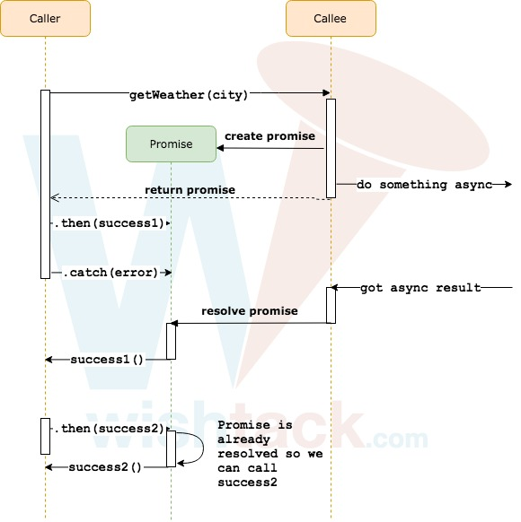

# Promise

Le concept de **`Promise`** date des années 70. Les **`Promise`**s sont parfois appelés **`Future`** ou **`Deferred`**.

En 2010, le développeur Kris Kowal inspire la communauté JavaScript en implémentant ce concept pour NodeJS via la librairie Q [https://github.com/kriskowal/q](https://github.com/kriskowal/q). Les implémentations se sont ensuite démultipliées jusqu'à ce que les `Promise`s deviennent un standard avec ES6.

## Fonctionnement des `Promise`s

Le fonctionnement d'une `Promise` est généralement le suivant :

1. Un appelant fait appel à une fonction qui procède à un traitement asynchrone mais **retourne de façon synchrone** un objet container _**\(la `Promise`\)**_ à l'appelant.

2. A ce stade, la `Promise` est le plus souvent dans un état "pending".

3. L'appelant inscrit sur la `Promise` une "callback" de succès pour être informé quand le résultat est disponible \(e.g. : `promise.then(data => console.log(data)`\) et une callback d'erreur pour être informé de l'échec \(e.g. : `promise.catch(error => console.error(error)`\).

4. Quand la fonction appelée obtient le résultat _\(ou une erreur\)_, elle notifie la `Promise` qui passe alors à un état "resolved" _\(ou "rejected"\)_.

5. La `Promise` déclenche alors toutes les fonctions de "callback" de succès _\(ou d'erreur\)_ qui ont pu lui être transmises \(via les méthodes `.then` et `.catch`\).



## Consommation d'une `Promise`

A titre d'exemple, nous allons utiliser la fonction `fetch` désormais standard qui vient déloger la poussiéreuse `XMLHttpRequest`.

Cette fonction a la particularité de retourner une `Promise`.

```typescript
fetch('')
    .then(response => {
        console.log(response.status);
    });
```

Pour accéder au "body" de la response, il faut utiliser la méthode `Response.json` qui retourne une `Promise` également.

```typescript
fetch('https://www.googleapis.com/books/v1/volumes?q=extreme%20programming')
    .then(response => {
        
        response.json()
            .then(data => {
                console.log(data.totalItems);
            });
        
    });
```

Malheureusement, pour le moment, les problèmes associés au "callbacks waterfall" persistent.

## Chaînage de `Promise`s

Pour éviter les "callbacks waterfall", il est possible de chainer les `Promise`. En effet, les méthodes `Promise.then` et `Promise.catch` retournent des `Promise`s.

### Chaînage synchrone

```typescript
fetch('https://www.googleapis.com/books/v1/volumes?q=extreme%20programming')
    .then(response => response.status)
    .then(status => console.log(status);
```

La ligne 1 retourne une `Promise` contenant la `Response` _\(elle est donc de type `Promise<Response>`\)_.

La ligne 2 crée à son tour une nouvelle `Promise` déduite de la première et contenant le "status" _\(elle est donc de type `Promise<number>`\)._

La ligne 3 consomme donc le résultat de la `Promise` précédente.

### Chaînage asynchrone

Une autre propriété intéressante des `Promise` est que **si la valeur retournée** à l'une des étapes **est une `Promise`**, alors l'étape suivante **ne sera appelée que quand la `Promise` sera "resolved"** et elle recevra en paramètre le résultat de résolution.

```typescript
fetch('https://www.googleapis.com/books/v1/volumes?q=extreme%20programming')
    .then(response => response.json())
    .then(data => console.log(totalItems);
```

### Chaînage et gestion d'erreurs

Si une erreur se produit à n'importe quelle étape soit car :

* la `Promise` initiale est "rejected",
* l'une des étapes lève une exception,
* ou l'une des étapes retourne une `Promise` "rejected,

alors **toutes les étapes suivantes sont ignorées** et la "callback" associée au premier "catch" de la chaîne _\(à partir de l'erreur\)_ est appelé.

```typescript
fetch('https://www.googleapis.com/books/v1/volumes?q=extreme%20programming')
    .then(response => response.JSON())
    .then(data => console.log(totalItems))
    .catch(error => console.error(error));
```

Nous obtenons alors l'erreur `response.JSON is not a function` à la ligne 4 _\(car la méthode se nomme `json` et non `JSON`\)_.

## Création de `Promise`s

Pour créer une `Promise`, il faut instancier la classe `Promise` tel qu'indiqué ci-dessous et appeler la fonction "resolve" avec la donnée de résolution en cas de succès ou la méthode "reject" avec l'objet d'erreur en cas d'échec.

```typescript
const getCurrentCity = () => {

    return new Promise((resolve, reject) => {
    
        /* Simulating some async stuff... */
        setTimeout(() => {
        
            if (hasPermission !== true) {
                reject(new Error('Permission denied!'));
                return;
            }
            
            resolve('Lyon');
        
        }, 1000);
    
    });

};

getCurrentCity()
    .then(city => getWeatherInfo(city))
    .then(weatherInfo => console.log(weatherInfo.temperature))
    .catch(error => console.error(error));
```


Une `Promise` ne peut être "resolved" ou "rejected" qu'une seule fois.

**C'est le premier appel qui gagne** et qui définit donc l'état final de la `Promise`, les appels suivants sont simplement ignorés.


> Vivement le jour où les appels superflus de "resolve" et "reject" déclencheront des erreurs.

## Limitation du Scope

Parmi d'autres limitations que nous aborderons plus tard, dans le dernier exemple, on peut remarquer l'indisponibilité de la variable `city` lors du `console.log` de l'étape finale _\(ligne 23\)_.

Il existe bien sûr des solutions de contournement mais peu séduisantes. Il est préférable d'adopter directement l'approche [Async / Await](async-await.md) pour éviter ces problèmes.

