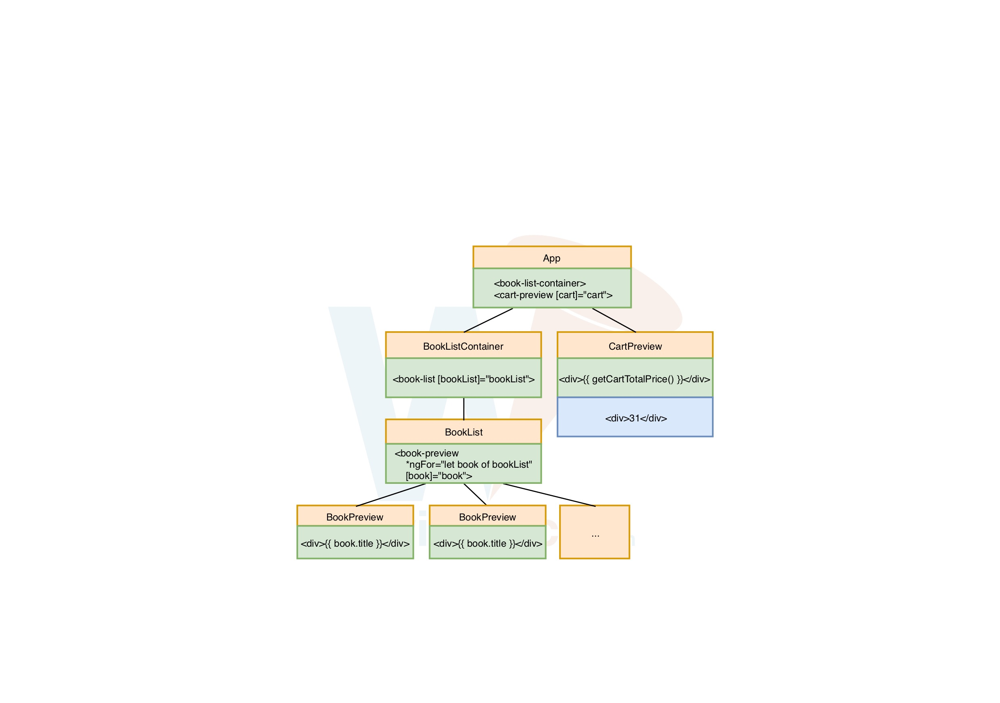
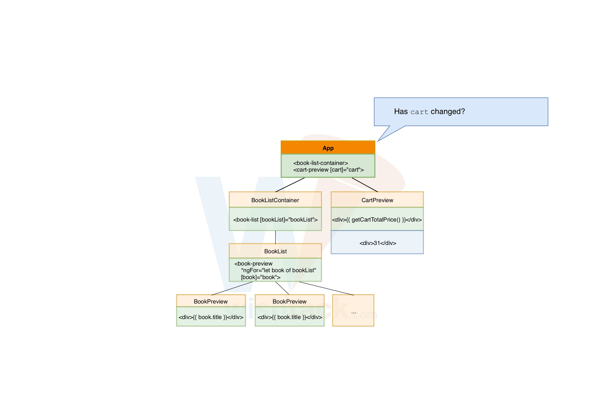
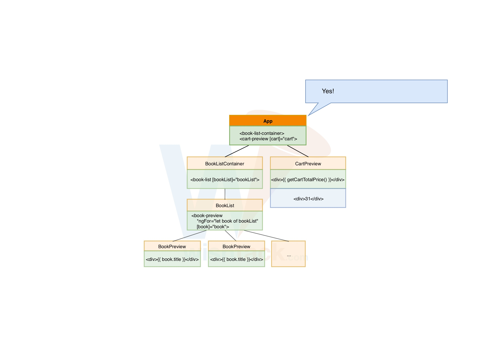
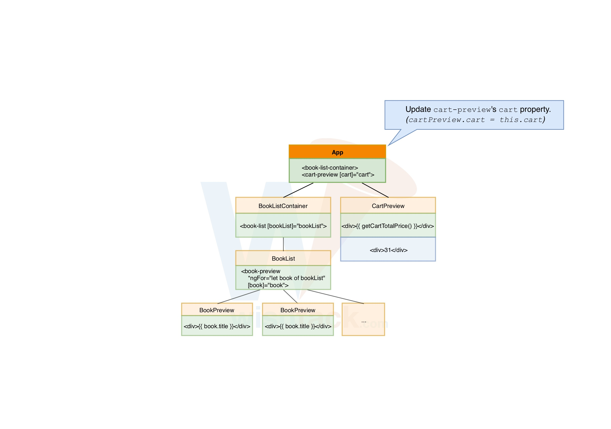
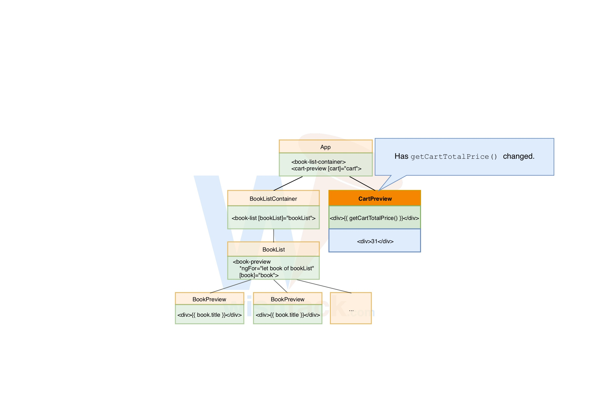

# Fonctionnement de la Change Detection

Angular adopte une [Approche Déclarative](les-approches-possibles.md) afin de maintenir en synchronisation le modèle et la vue.

## Change Detector

**Chaque composant dispose d'un "change detector"** qui comme son nom l'indique se charge de détecter les changements de modèle concernant la vue et de mettre à jour la vue en conséquence.

Le "Change Detector" est fortement couplé à la vue du composant associé. Cela lui permet d'**analyser la liste des expressions utilisées dans la vue** _\(i.e._ [_Template Interpolation_](../composants/template-interpolation.md) _ou_ [_Property Binding_](../composants/property-binding.md)_\) \_en les comparant à la dernière valeur retournée par chacune d'elles_.\_

**Si la valeur** retournée par l'expression **change**, **la vue est mise à jour** en conséquence.

## Déclenchement de la "Change Detection"

Pour détecter les changements, Angular utilise la librairie [Zone.js](https://github.com/angular/zone.js) dont le rôle est d'encapsuler et d'intercepter tous les appels asynchrones _\(e.g._ `setTimeout`_, event listeners etc...\)_.

Avant le chargement d'Angular, Zone.js procède au [Monkey patching ](https://en.wikipedia.org/wiki/Monkey_patch)des fonctions natives permettant d'inscrire des "callbacks" associées à des traitements asynchrones \_\(e.g. `setTimeout`\) \_afin de pouvoir détecter chaque "tick" et notifier Angular.


Zone.js est également utilisé pour reconstruire des "callstacks" d'appels asynchrones.


## Fonctionnement de la Change Detection

### 1. Déclenchement de la "change detection"

A la **fin de chaque "tick"** _\(détecté grâce à Zone.JS\)_, Angular déclenche la **"Change Detection" du "Root Component"**.

### 2. **"Change Detection" de chaque composant**

Le **"Change Detector"** du composant **compare les anciennes et les nouvelles valeurs** de chaque **expression** utilisée dans les **bindings** _\(_[_Template Interpolation_](../composants/template-interpolation.md) _ou_ [_Property Binding_](../composants/property-binding.md)_\)_.

### 3. **Mise à jour de la vue si nécessaire**

En cas de changement, l'élément concerné est mis à jour dans la vue.

### 4. **Vérification récursive**

Le "Change Detector" de chaque "child component" est ensuite déclenché et l'étape 2 est reproduite pour chaque composant de façon récursive.

### 5. Double check

_**\[Uniquement en mode développement\]**_ Angular relance l'intégralité de la "Change Detection" pour s'assurer que les valeurs retournées par les expressions ne changent pas.  
Cela permet de détecter les problèmes de conception ou d'implémentation tels que le changement du modèle par effet de bord ou les expressions dont le résultat est aléatoire.



























