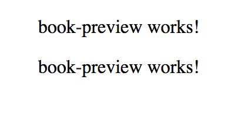

# Création de Composants

Pour créer de nouveaux composants, il suffit de créer la classe du composant, le fichier de template associé et surtout ajouter la classe à la liste des `declarations` du module associé.  
Pour le moment, nous n'avons qu'un seul module `AppModule` dont on analysera le contenu plus tard dans la section [Project Structure & Modules](../project-structure-and-modules/).

La création manuelle de ces fichiers peut s'avérer fastidieuse au quotidien et surtout "error-prone". C'est pour cette raison qu'Angular CLI fournit nativement des commandes permettant de générer le code nécessaire à la déclaration d'un composant _\(entre autres\)_. Ces générateurs de code se basent sur l'outil [Schematics](../../tools/angular-cli.md#schematics) fourni par Angular.

## Génération du composant `book-preview`

Pour générer un composant, il suffit de lancer la commande suivante :

```bash
yarn ng generate component book/book-preview
```

Nous avons décidé d'indiquer le "path" cible `book/` afin de regrouper tous les composants _\(et autres fichiers\)_ associés à la fonctionnalité "book" dans ce dossier là. Ce dossier deviendra plus tard un "[feature module](../project-structure-and-modules/)".


Pour un projet contenant une seule application, le "root path" est `src/app`.



Cela génère le contenu suivant en respectant le "[style guide](https://angular.io/guide/styleguide)" Angular :

* `book-preview.component.ts` : Classe TypeScript `BookPreviewComponent` du composant .
* `book-preview.component.html` : Template HTML du composant .
* `book-preview.component.scss` : Fichier CSS du composant. Dans notre cas, le fichier a une extension `.scss` car nous avons opté pour le [SASS](https://sass-lang.com/) en l'indiquant dans notre configuration `yarn ng set defaults.styleExt=scss`.
* `book-preview.component.spec.ts` : Squelette des tests unitaires du composant .

... et met à jour le fichier `app.module.ts` dont nous analyserons le contenu [plus tard]().


N'oubliez pas d'ajouter et de "commit" les fichiers générés et modifiés.


Nous pouvons désormais utilisé notre nouveau composant dans le template du composant `app` par exemple :




```markup
<wt-book-preview></wt-book-preview>
<wt-book-preview></wt-book-preview>
```





## `yarn ng` vs. `ng`


Il est recommandé d'utiliser la commande `yarn ng` au lieu de `ng` _\(contrairement à ce que l'on peut remarquer sur de nombreuses documentations et exemples\)_ pour les raisons suivantes :

* La commande `yarn ng`, utilise la version d'Angular CLI installée localement sur votre projet. Tous les développeurs _\(et outils\)_ utilisent alors la même version.
* La commande `ng` n'est pas forcément disponible globalement dans tous les environnements. Certains développeurs _\(ou outils\)_ risquent donc d'être surpris en exécutant la même commande sur leur environnement.

Heureusement, si les versions de l'Angular CLI globale et la locale ne correspondent pas, Angular CLI lance la version locale en affichant une alerte.



Pour éviter tous ces ennuis et pour pouvoir factoriser dans votre équipe les options utilisées pour générer des composants, pourquoi ne pas ajouter un script à votre `package.json`:

```javascript
"generate:component": "ng generate component --export"
```

permettant aux développeurs de générer des composants avec la commande :

```bash
yarn generate:component book/book-preview
```

... au lieu de devoir expliquer la commande `ng g c` à chaque nouvel arrivant.



