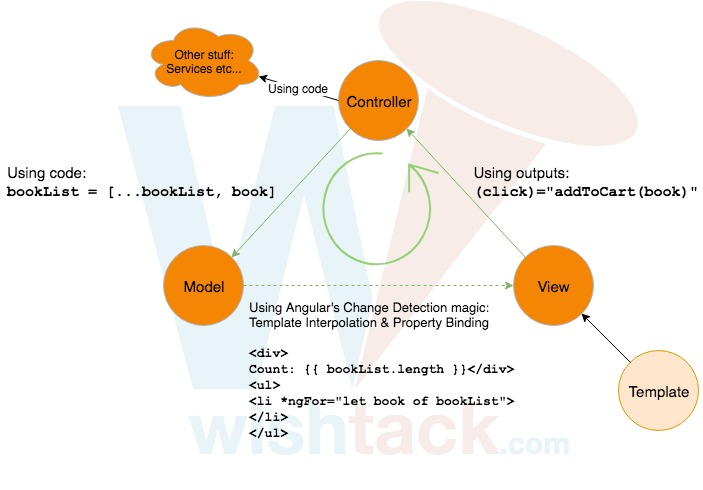
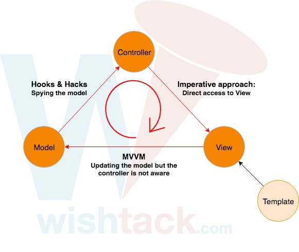

# L'approche MVC

## MVC \(Model-View-Controller\)

Angular repose principalement sur une approche MVC où :

* **Le "controller" et le "model"** sont représentés par l'instance de la classe TypeScript du composant.
* **La "view"** est le DOM \(ou autre\) généré à partir du template.

1. La "view" est générée à partir des instructions du "template".
2. La "view" déclenche des actions sur le "controller" via des "outputs" \(ou [event binding](event-binding.md)\).
3. Le "controller" met à jour l'état du "model".
4. Grâce à son mécanisme de "Change Detection", Angular détecte les changements et met à jour la "view" si nécessaire.

## Violations du MVC Angular

Malheureusement, il arrive souvent _\(et dans de nombreux exemples_ [_https://angular.io/guide/user-input\#get-user-input-from-a-template-reference-variable_](https://angular.io/guide/user-input#get-user-input-from-a-template-reference-variable)_\)_  que l'on cède à une approche impérative traditionnelle où le "controller" se permet d'accéder explicitement à la "view" pour lire ou modifier son contenu.


Evitez d'accéder directement à votre "view" depuis le "controller" via des "template local variables" ou le décorateur `@ViewChild` !

Avec cette approche impérative, on ne respecte plus le cycle MVC, on crée alors une dépendance entre le "controller" et la "view" que nous avions éviter jusqu'à présent et le "model" n'est plus la "single source of truth".


Cela est bien sûr inévitable dans des cas très particuliers, localisés et bas niveau _\(e.g. : implémentation d'un wrapper Angular pour une librairie JavaScript\)_.

## MVVM \(Model-View-ViewModel\)

L'approche MVVM est possible dans certains cas étant donné qu'il ne s'agit de rien d'autre qu'une approche MVC dans le Controller est implicite mais il vaut mieux l'éviter pour garder le contrôle de l'état de votre modèle.

