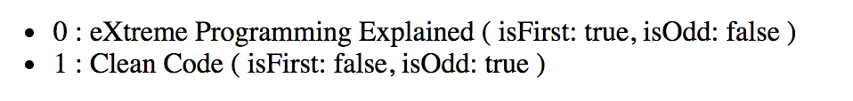

# \*ngFor

La directive structurelle `ngFor` permet de boucler sur un array et d'injecter les éléments dans le DOM.

```markup
<ul>
    <li *ngFor="let book of bookList">{{ book.name }}</li>
</ul>
```



```typescript
export class AppComponent {
    bookList = [
        {
            name: 'eXtreme Programming Explained'
        },
        {
            name: 'Clean Code'
        }
    ];
}
```



Il est possible de récupérer d'autre informations telles que l'index de l'élément :

* `index` : position de l'élément.
* `odd` : indique si l'élément est à une position impaire.
* `even` : indique si l'élément est à une position paire.
* `first` : indique si l'élément est à la première position.
* `last` : indique si l'élément est à la dernière position.



```markup
<ul>
    <li *ngFor="let book of bookList; let index = index; let isFirst = first; let isOdd = odd;">
        <span>{{ index }}</span>
        <span>:</span>
        <span>{{ book.name }}</span>
        <span>( isFirst: {{ isFirst }}, isOdd: {{ isOdd }} )</span>
    </li>
</ul>
```





