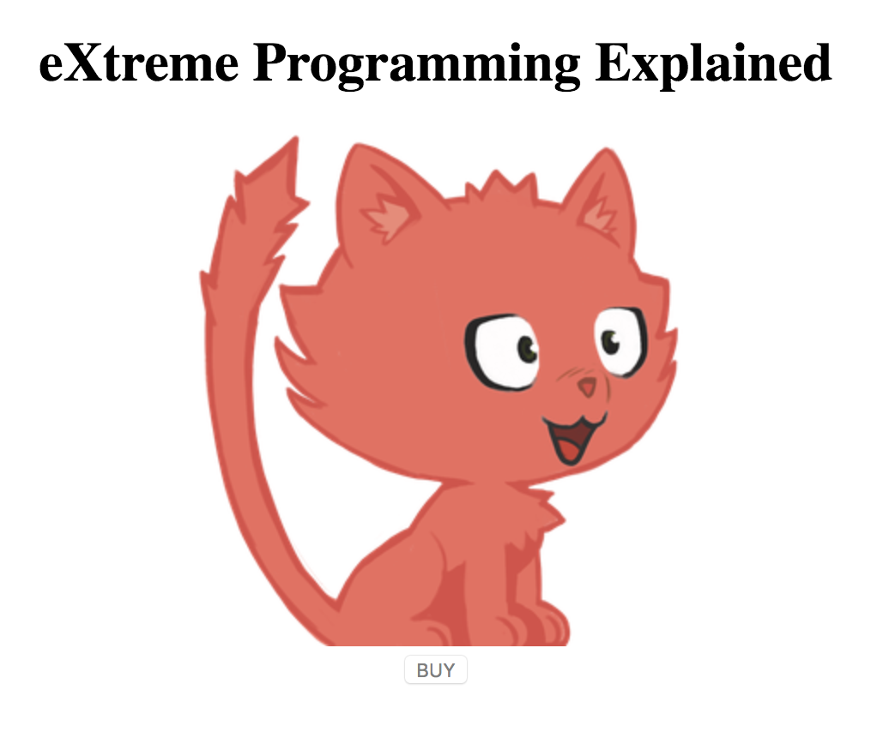

# Property Binding

L'interpolation ne suffira pas pour tout contrôler _\(images, styles, etc...\)_.

Mieux que le contrôle des attributs, le "property binding" nous permet de contrôler n'importe quelle propriété d'un élément du DOM en s'inspirant de la syntaxe native _\(Vanilla JS\)_ : `button.disabled = false` ou encore `button['disabled'] = false` _\(pour désactiver un bouton par exemple\)_.

Ce qui donne la syntaxe suivante :



```markup


<button type="button" [disabled]="!isAvailable">BUY</button>
```



Ou en laissant le code respirer :



```markup


<button
        type="button"
        [disabled]="!isAvailable">BUY</button>
```



Les données proviennent encore du code TypeScript du composant.



```typescript
...

export class AppComponent {

    bookName = 'eXtreme Programming Explained';
    bookPictureUrl = 'https://robohash.org/xp?set=set4';
    isAvailable = false;

}
```





