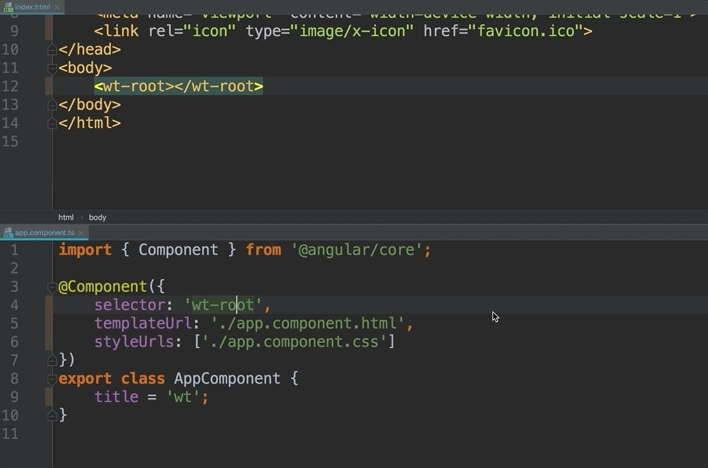

# Root Component

Une application Angular est généralement composé d'un “root component“ qui sera l'élément le plus haut de la hiérarchie de composants Angular.

## `index.html`

Ce composant est utilisé dans le fichier `src/index.html` qui est la page HTML accueillant l'application Angular.



```markup
<!doctype html>
<html lang="en">
<head>
    ....
</head>
<body>
    <wt-root></wt-root>
</body>
</html>
```



Il s'agit du tag HTML `<wt-root>` utilisant le préfixe `wt` choisi lors de la création de l'application.

## `AppComponent`

Le composant est défini dans le fichier `src/app/app.component.ts` dont voici une version plus minimaliste :



```typescript
import { Component } from '@angular/core';

@Component({
    selector: 'wt-root',
    template: `
<h1>Hello real 🌎!</div>
`
})
export class AppComponent {
}
```



**Un composant Angular n'est rien d'autre qu'une classe...**

... avec un décorateur `@Component`.

## `@Component`

Ce décorateur prend un paramètre une configuration qui contient au minimum :

* **selector :** le sélecteur CSS qui permettra de lier le tag HTML de l'élément et le code du composant.
* **template :** le template HTML utilisé par Angular pour générer le contenu de l'élément dans le DOM.

Par bonne pratique, nous n'utiliserons pas la propriété `template` pour définir le template HTML mais plutôt **`templateUrl`** qui permet d'indiquer le chemin vers le fichier HTML du template associé au composant.

```typescript
templateUrl: './app.component.html'
```

Le résultat sera identique _\(le fichier HTML n'est pas téléchargé en runtime mais plutôt consommé au "build"\)_ mais le code sera plus clair et la "separation of concerns" mieux respectée.


La convention de nommage pour un composant est la suivante :

* Les fichiers sont en "kebab-case" suffixés par `.component.ext`. _\(e.g. :_ `book-preview.component.ts` & `book-preview.component.html`_\)_
* La classe est en "PascalCase" suffixée par `Component`. _\(e.g. :_ `BookPreviewComponent`_\)_
* Le sélecteur CSS doit être un sélecteur de tag en "kebab-case" préfixé par le suffixe du produit. _\(e.g. :_ `wt-book-preview`_\)._



Le squelette par défaut ne respecte pas la dernière règle _\(utilisation de `wt-root` au lieu de `wt-app`\)_.

N'hésitez pas à "refactor".




## Code source

[https://github.com/wishtack/wishtack-book-shop/tree/1-bootstrap](https://github.com/wishtack/wishtack-book-shop/tree/1-bootstrap)

## Démo StackBlitz



