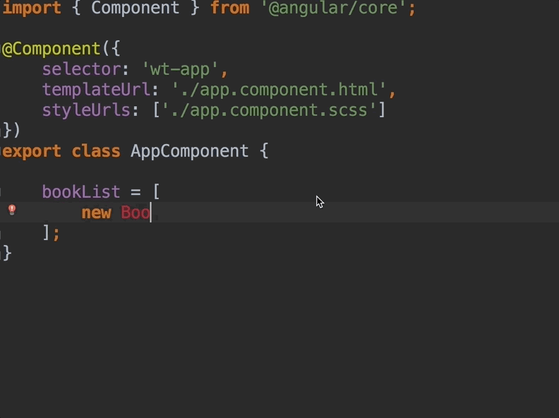
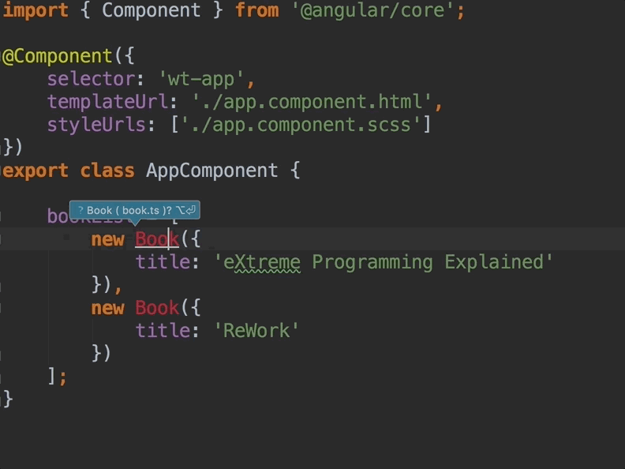

# Container vs. Presentational Components

Supposons que nous disposons dans notre composant `app`, d'une liste `bookList` contenant une liste d'instance d'une classe `Book` que nous souhaitons afficher.



```typescript
export class Book {

    title?: string;

    constructor(args: Book = {}) {
        this.title = args.title;
    }

}
```





```typescript
import { Book } from './book/book';

...
export class AppComponent {
    bookList = [
        new Book({
            title: 'eXtreme Programming Explained'
        }),
        new Book({
            title: 'ReWork'
        })
    ];
};
```




Laissez bien sûr l'IDE s'occuper des imports via l'auto-complete ou l'auto-import _\(Alt + Enter chez JetBrains\)_.






Il serait intéressant de déléguer l'affichage de chaque `book` au composant `book-preview` que nous pourrons réutiliser plus tard dans d'autres contextes.

Dans ce cas, nous séparons les responsabilités entre le composant `app` et le composant `book-preview`. 



```markup
<!-- Display one book-preview component for each book... -->
<!-- ...but we need to find some way to pass the book to each component. -->
<wt-book-preview
        *ngFor="let book of bookList"></wt-book-preview>
```



## Container Component _\(ou Smart Component\)_

Le composant `app` **s'occupe donc de la "business logic"** et sélectionne les objets `book` à afficher via la propriété `bookList`.  
Il est donc un "Container Component" qui délègue l'affichage à des "Presentational Components".

## Presentational Component _\(ou Dumb Component\)_

Le composant `book-preview` ne sait pas d'où provient le `book` à afficher mais il sait l'afficher.  
Il est donc un "Presentational Component" qui est débarrassé de la "business logic".

## Article plus détaillé sur le sujet

{% embed data="{\"url\":\"https://blog.wishtack.com/2017/05/05/the-guide-to-building-quality-angular-2-components/\",\"type\":\"link\",\"title\":\"The Guide to Building Quality Angular 2+ Components\",\"description\":\"Learn how to split code and responsibilities between Angular components.\",\"icon\":{\"type\":\"icon\",\"url\":\"https://wishtackblog.files.wordpress.com/2017/03/cropped-wishtack\_logo\_1024x1024.png?w=192\",\"width\":192,\"height\":192,\"aspectRatio\":1},\"thumbnail\":{\"type\":\"thumbnail\",\"url\":\"https://wishtackblog.files.wordpress.com/2017/05/angular-components-responsibilities-table.png\",\"width\":632,\"height\":161,\"aspectRatio\":0.254746835443038}}" %}

## Interaction entre Composants

Il ne reste plus au composant app qu'à communiquer chaque `book` au composant `book-preview` associé. Cf. [Interaction entre Composants](interaction-entre-composants/).

