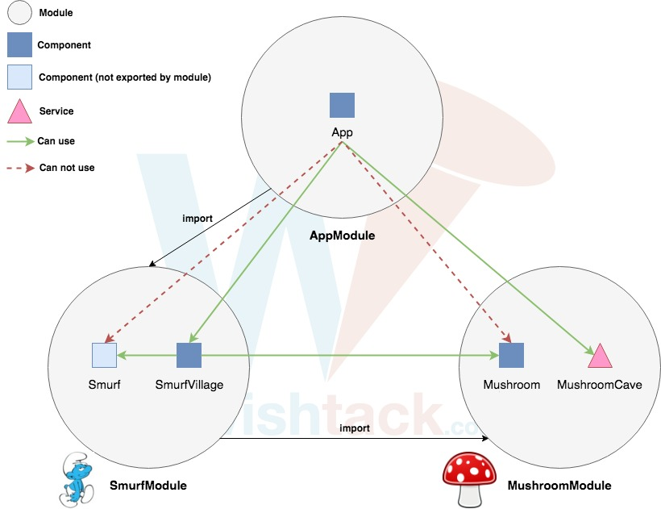

# Portée des Services

## Injector Tree

Angular ne dispose pas que d'un seul "injector" mais d'un arbre d'"injectors".

### Root Injector

Tous **les "providers" définis par les modules importés directement ou indirectement par l'`AppModule`** sont injectés par le "root injector" et **sont donc accessibles dans toute l'application**.



### Component Injector

Chaque composant dispose d'un "injector" et peut définir des "providers" via la propriété `providers` de sa configuration.

Ces "providers" vont écraser les "providers" parents _\(ceux des composants parents ou du "root injector"\)_ et définir **de nouvelles instances des services associés pour chaque instance du composant**. 



```typescript
@Component({
    providers: [
        BookRepository
    ]
})
export class BookPreviewComponent {
}
```




Il est préférable d'éviter cette approche et d'utiliser des [Inputs / Outputs pour interagir avec les "child components"](../interaction-entre-composants/). Autrement, les composants auront des comportements **différents et parfois imprédictibles** en fonction de l'endroit où ils sont utilisés.


### Lazy Loading

Dans le cas du [Lazy Loading](../routing/), les modules Angular sont chargés de façon asynchrone et afin d'éviter de perturber le "root injector", ces derniers créent des "child injectors".


Le danger dans ce cas est de réimporter un module définissant des "providers" et on se retrouve alors avec plusieurs instances du même "service".

Cela pose particulièrement problème pour les "**stateful services**".


## Feature Service Module


Pour éviter le problème de double instanciation de "**stateful services**" décrit [ci-dessous](portee-des-services.md#lazy-loading), la bonne pratique la plus commune est de créer **des modules dédiés** à la définition des "providers" de "**stateful services**" qui seront ensuite importés uniquement par le "root module" `AppModule`.




```typescript
@NgModule({
    providers: [
        BookRepository
    ]
})
export class BookCoreModule {
}
```





```typescript
@NgModule({
    imports: [
        BookCoreModule
    ]
})
export class AppModule {
}
```




Cette approche reste fragile car à la moindre inattention, le module `BookCoreModule` peut se retrouver importé _\(directement ou indirectement\)_ par d'autres modules "lazy loaded" et le même problème se reproduira. 


## `Module.forRoot`


La bonne pratique est de ne pas définir les "providers" de "stateful services" dans le module mais plutôt via une méthode statique conventionnellement nommée `forRoot` dont le résultat est importé par le "root module" `AppModule`. 




```typescript
@NgModule({
})
export class BookCoreModule {

    static forRoot(): ModuleWithProviders {
        return {
            ngModule: BookCoreModule,
            providers: [
                BookRepository
            ]
        };
    }

}
```





```typescript
@NgModule({
    imports: [
        BookCoreModule.forRoot()
    ]
})
export class AppModule {
}
```



Les modules "lazy loaded" qui importent le module `BookCoreModule` ne produiront alors pas de doublon.

Cette approche est malheureusement encore loin d'être parfaite :

* la syntaxe `forRoot` est overkill ;
* rien n'empêche l'import `BookCoreModule.forRoot()` de dans un module autre que le "root module" ;
* tous les "stateful services" sont importés par le "root module" dès le chargement de l'application et peut-être inutilement.

C'est pour ces raisons qu'Angular 6 a introduit la notion de [Tree-Shakable Services](tree-shakable-services.md).

