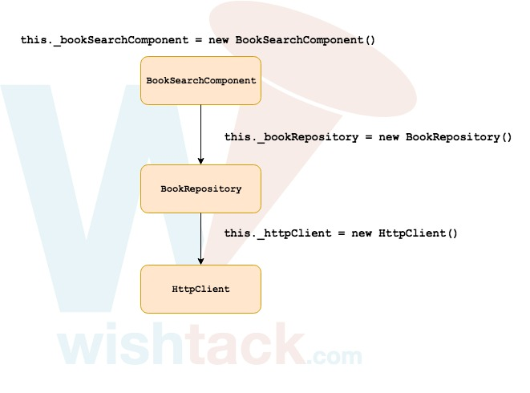
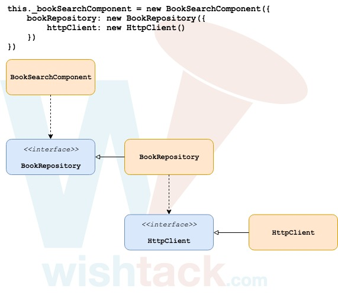
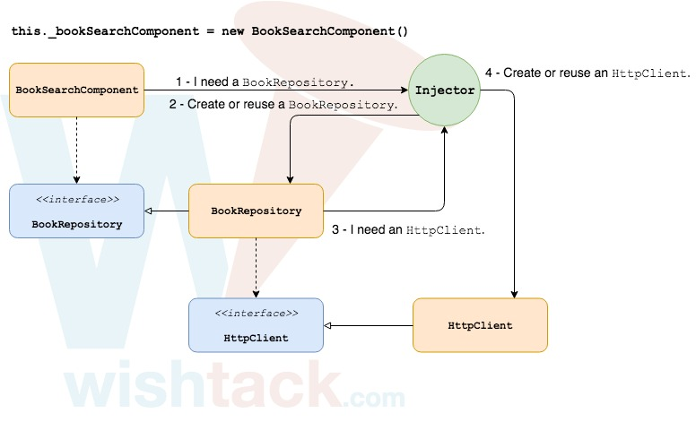

# Qu'est-ce que la "Dependency Injection" ?

La "Dependency Injection" **est un "design pattern"** qui consiste à **séparer l'instanciation** _\(et donc l'implémentation\)_ d'une dépendance **et son utilisation**.

## Pourquoi ?

Ce "design pattern" permet :

* d'**inverser les dépendances**,
* d'**éviter le couplage fort** avec les dépendances,
* de **factoriser l'instanciation** d'une dépendance,
* de **faciliter le remplacement** d'une dépendance par une autre implémentation **à des fins fonctionnelles ou de "testing“**.

## Comment ?

### Sans "Dependency Injection"

### Dependency Inversion

### Dependency Injection

