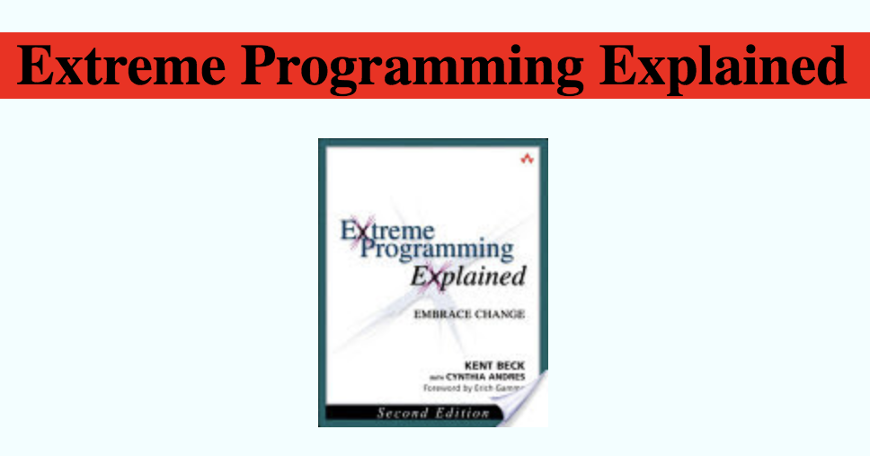

# Attribute Directive

Les "Attribute Directives" permettent de **modifier le comportement** d'un élément, un composant ou une autre directive.

## Déclaration d'une Directive

Les directives sont déclarés quasiment de la même façon qu'un composant sauf qu'**elles n'ont pas de template**.



```typescript
@Directive({
    selector: '[wtHighlight]'
})
export class HighlightDirective {
}
```




La directive doit ensuite être ajoutée aux `declarations` _\(et `exports`\)_ du module associé _\(qui doit être importé par les modules contenant les composants qui l'utilisent\)_.

```typescript
@NgModule({
    declarations: [
        HighlightDirective
    ],
    exports: [
        HighlightDirective
    ]
})
...
```



La convention est d'utiliser des sélecteurs à base d'**attributs** : `[wtHighlight]`.  
Les noms d'attributs doivent être **préfixés** avec le préfixe de votre application _\(e.g. `wt`\)_.

Evitez les sélecteurs à base de classes CSS ou tag HTML.


### Angular CLI

Les directives peuvent être générées à l'aide d'Angular CLI.

```bash
yarn ng generate directive --export highlight
```

## `ElementRef`

La "Dependency Injection" permet de récupérer via la classe `ElementRef`, **une référence vers l'objet permettant de manipuler l'élément DOM associé**.



```typescript
@Directive({
    selector: '[wtHighlight]'
})
export class HighlightDirective implements OnInit {

    constructor(private _elementRef: ElementRef) {
    }

    ngOnInit() {
        this._elementRef.nativeElement.style.backgroundColor = 'red';
    }

}
```



## Utilisation d'une Directive

Pour appliquer une directive à un élément, il suffit de lui **ajouter l'attribut** indiqué dans le `selector` de la directive.


Si le module contenant la directive n'est pas importé, **la directive ne sera pas activée sur l'élément** et Angular ne produit **aucune erreur** car pour ce dernier il ne s'agit que d'un attribut superflu.




```markup
<h1 wtHighlight>{{ book.title }}</h1>
```





## `@HostListener()`

`@HostListener()` est un décorateur permettant d'**ajouter un "listener" sur l'élément** sur lequel la directive est appliquée _\("host element"\)_.



```typescript
@Directive({
    selector: '[wtHighlight]'
})
export class HighlightDirective {

    constructor(private _elementRef: ElementRef) {
    }

    @HostListener('mouseenter') applyBackgroundColor() {
        this._setBackgroundColor('red');
    }

    @HostListener('mouseleave') removeBackgroundColor() {
        this._setBackgroundColor(null);
    }

    private _setBackgroundColor(color: string) {
        this._elementRef.nativeElement.style.backgroundColor = color;
    }

}
```



## Configuration et Interaction avec une Directive

Les directives peuvent être **personnalisés avec des** [**`@Input()`**](../interaction-entre-composants/input.md) et il est également possible de **remonter des événements au composant parent via des** [**`@Output()`**](../interaction-entre-composants/output.md).



```typescript
@Directive({
    selector: '[wtHighlight]'
})
export class HighlightDirective {

    @Input() color = 'red';

    constructor(private _elementRef: ElementRef) {
    }

    @HostListener('mouseenter') applyBackgroundColor() {
        this._setBackgroundColor(this.color);
    }

    @HostListener('mouseleave') removeBackgroundColor() {
        this._setBackgroundColor(null);
    }

    private _setBackgroundColor(color: string) {
        this._elementRef.nativeElement.style.backgroundColor = color;
    }

}
```



La directive peut alors être utilisée de la façon suivante :

```markup
<h1 wtHighlight [color]="getBookHighlightColor(book)">{{ book.title }}</h1>
```


A condition que cela n'introduise pas d'ambigüité, **il est possible d'utiliser l'attribut de la directive comme** [**`@Input()`**](../interaction-entre-composants/input.md).

```typescript
@Input('wtHighlight') color = 'red';
```

La directive peut alors être utilisée ainsi :

```markup
<h1 [wtHighlight]="getBookHighlightColor(book)">{{ book.title }}</h1>
```

ou si la valeur est un `string` :

```markup
<h1 wtHighlight="red">{{ book.title }}</h1>
```


