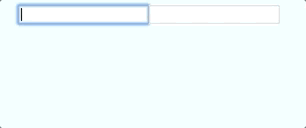

# Template-driven Forms 🤢

L'approche "Template-driven Forms" nécessite de mettre **la majeure partie de la logique du formulaire dans le template**. Cela donne une fausse impression de "quick win" au départ et le code devient rapidement **difficile à maintenir et à tester**.

## 1. `ngModel`

La [Directive](../directives/) `ngModel` est au coeur des "Template-driven Forms".

Elle permet principalement de **"binder" dans les deux sens le "model" avec la "view"**.  
C'est ce que l'on appelle le "**Two-way Binding**".



```typescript
@Component({
    templateUrl: './book-form.component.html'
})
export class BookFormComponent {
    bookTitle: string;
}
```





```markup
<form>
    <input
        name="title"
        [(ngModel)]="bookTitle">
</form>
```



A chaque modification du "model", la "view" sera mise à jour et inversement.


La syntaxe `[(property)]="data"` n'est que **du "syntactic sugar"** pour signifier [Input](../interaction-entre-composants/input.md) + [Output](../interaction-entre-composants/output.md).

Ce raccourci et automagiquement disponible s'il existe un `Output` portant exactement le même nom que l'`Input` avec le suffixe `Change`.

En voici la version longue :

```markup
<wt-something
    [property]="data"
    (propertyChange)="data = $event"></wt-something>
```

... ou pour `ngModel` :

```markup
<input
    name="title"
    [ngModel]="bookTitle"
    (ngModelChange)="bookTitle = $event">
```



On obtient l'erreur suivante :

`Can't bind to 'ngModel' since it isn't a known property of 'input'`

... car l'`Input` `ngModel` est ajouté via la "directive" `NgModel` \([https://github.com/angular/angular/blob/master/packages/forms/src/directives/ng\_model.ts](https://github.com/angular/angular/blob/master/packages/forms/src/directives/ng_model.ts)\) mais cette "directive" n'est pas importée nativement.

Pour profiter de la directive `NgModel`, **il faut importer le module `FormsModule`** dans les modules contenant des composants qui en dépendent.

```typescript
import { FormsModule } from '@angular/forms';

@NgModule({
    ...
    imports: [
        FormsModule
    ]
})
export class BookModule {
}
```


### Exemple de "Two-way Binding"

En utilisant le template HTML suivant :



```markup
<form>

    <input
            name="title"
            type="text"
            [(ngModel)]="bookTitle">
    <input
            name="title"
            type="text"
            [(ngModel)]="bookTitle">
    
    <div>{{ bookTitle }}</div>

</form>
```



... on peut constater le fonctionnement du "Two-way Binding" :



## 2. Détection du "submit" avec `ngSubmit`

Pour détecter le "submit" du formulaire, il faut utiliser l'`Output` `ngSubmit` sur l'élément `form`.



```markup
<form (ngSubmit)="submitBook()">
​
    <input
            name="title"
            type="text"
            [(ngModel)]="bookTitle">
            
    <button type="submit">SUBMIT</button>
​
</form>
```





```typescript
export class BookFormComponent {

    bookTitle: string;
    
    submitBook() {
        console.log(this.bookTitle);
        /* Reset book's title. */
        this.bookTitle = null;
    }

}
```




**Préférez** le "listener" de `submit` _\(via l'**`Output` `ngSubmit`**\)_ sur le formulaire **plutôt que le "listener" de `click`** sur les boutons.  


### `submit` vs `ngSubmit`


Bien qu'il soit possible d'utiliser l'[Event Binding](../composants/event-binding.md) sur l'événement `submit` natif du formulaire, **il est fortement recommandé d'utiliser l'`Output` `ngSubmit`** ajouté par le module `FormsModule`.

Contrairement à l'[Event Binding](../composants/event-binding.md) sur l'événement submit, **l'`Output` `ngSubmit` empêche le comportement par défaut du "browser"** _\(requête GET avec les données du formulaires\)_ via l'appel implicite de `event.preventDefault()` **même si le "listener" associé produit une erreur.**

Vous pouvez expérimenter la différence entre `submit` et `ngSubmit` en déclenchant une exception dans la méthode `submitBook` :

```typescript
submitBook() {
    throw new Error(`D'OH!`);
}
```


## Two-way Binding vs. Immutabilité

L'un des principaux problème des "Template-driven Forms" est le **non respect de l'immutabilité**.

Supposons que le composant `BookFormComponent` décrit précédemment serve à éditer un objet `Book`.



```typescript
export class BookFormComponent {

    @Input() book: Book;

    submitBook() {
    }

}
```





```markup
<form (ngSubmit)="submitBook()">

    <input
            name="title"
            type="text"
            [(ngModel)]="book.title">

    <button type="submit">SUBMIT</button>

</form>
```



Le "Two-way Binding" de la directive `ngModel` **modifie directement la propriété `title` de l'objet `book` transmis par le composant parent**.

**Dès le premier caractère** saisi, **il est déjà trop tard** car l'objet d'origine a été modifié et **l'opération ne peut être annulée**.


Il est bien sûr **possible** de détecter le changement de l'`Input` `book` est de **créer une copie locale** mais cela reste un **contournement** qui **ne respecte pas l'une des bonnes pratiques de l'immutabilité** qui consiste à **ne cloner les objets que pour les modifier afin de pouvoir détecter les changements simplement en comparant les références**.


