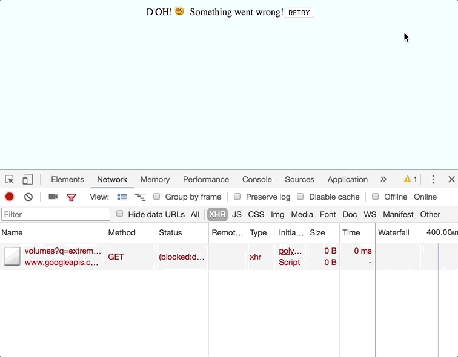
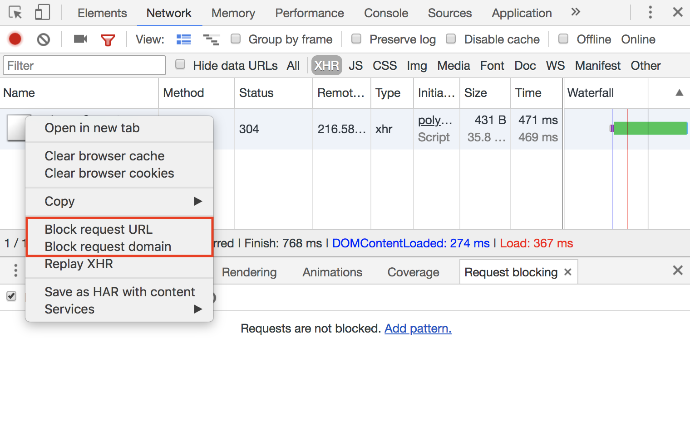

# Gestion de la Subscription ⚠️

Dans les exemples ci-dessus, l'objet `Subscription` retourné par la méthode `subscribe` est simplement ignoré.


Il faut s'assurer que **le composant `unsubscribe` de l'`Observable` avant sa destruction** _\(et également si une nouvelle requête est déclenchée par exemple en cas de "refresh"\)_.

Dans le cas d'`Observable`s infinis cela **évite des fuites mémoire et surconsommation CPU**.

Dans notre cas, cela **évite la congestion des requêtes HTTP** _\(dans le cas où le composant est détruit et reconstruit plusieurs fois rapidement par exemple ou encore lors de la navigation sur l'application via le_ [_Routing_](../routing/)_\)._


## `Unsubscribe` dans `ngOnDestroy` 

On profite généralement du "Lifecycle Hook" `ngOnDestroy` pour déclencher l'`unsubscribe`.



```typescript
private _bookListSubscription: Subscription;

constructor(private _bookRepository: BookRepository) {
}

ngOnInit() {
    this._bookListSubscription = this._bookRepository.getBookList()
        .subscribe(bookList => this.bookList = bookList);
}

ngOnDestroy() {
    this._bookListSubscription.unsubscribe();
}
```



Et par précaution dans le cas où la `subscription` est créé plus tard.



```typescript
ngOnDestroy() {
    if (this._bookListSubscription != null) {
        this._bookListSubscription.unsubscribe();
    }
}
```



**L'inconvénient** de cette approche est sa **verbosité**. **Elle en devient "error-prone"**.

## `Unsubscribe` avec l'opérateur `takeUntil`



```typescript
export class BookSearchComponent implements OnDestroy, OnInit {

    bookList: Book[];

    private _isDead$ = new Subject();

    constructor(private _bookRepository: BookRepository) {
    }

    ngOnInit() {
        this._bookRepository.getBookList()
            .pipe(takeUntil(this._isDead$))
            .subscribe(bookList => this.bookList = bookList);
    }

    ngOnDestroy() {
        this._isDead$.next();
    }

}
```




Il existe une approche similaire avec l'opérateur **`takeWhile`** qui se base sur un valeur "boolean" plutôt qu'un `Observable` mais il est **préférable de l'éviter**.

Contrairement à l'approche `takeUntil`, `takeWhile` ne peut pas détecter en temps réel le changement de la variable "boolean" et **la requête HTTP ne sera donc pas interrompue**. 


### Exemple

[https://github.com/wishtack/wishtack-book-shop/tree/7-unsubscribe-using-take-until](https://github.com/wishtack/wishtack-book-shop/tree/7-unsubscribe-using-take-until)




## Unsubscribe avec le [Pipe](../pipes.md) `async`

Dans les cas les plus simples, cette approche est la plus adaptée car c'est **la moins verbeuse** est **la plus réactive**.

Le "pipe" `async` permet de `préparer l'Observable dans le composant` et laisser **la vue `subscribe` quand elle en a besoin et si elle en a besoin**.



```typescript
export class BookSearchComponent {
    
    bookList$: Observable<Book[]>;

    constructor(private _bookRepository: BookRepository) {
        this.bookList$ = this._bookRepository.getBookList();
    }

}
```



Remarquez que l'**on se permet de créer l'`Observable` directement dans le constructeur**. En effet, tant que l'on ne `subscribe` pas, aucun traitement n'est déclenché.

### A éviter


Il est possible d'utiliser la syntaxe perturbante ci-dessous mais il est préférable de l'éviter.




```typescript
export class BookSearchComponent {
    
    bookList$ = this._bookRepository.getBookList();

    constructor(private _bookRepository: BookRepository) {
    }

}
```



### Fonctionnement du "pipe" `async`



```markup
<wt-book-preview
        *ngFor="let book of bookList$ | async"
        [book]="book"></wt-book-preview>
```



Le "pipe" `async` **`subscribe` à l'`Observable` `bookList$`** et **permet de mettre à jour la vue en conséquence**.

A la destruction de l'élément _\(e.g. : "toggle" de la liste via `*ngIf`\)_, **le "pipe" `async` `unsubscribe` automagiquement**.

### Gotcha

En essayant d'afficher le nombre de "book" en créant un autre `Observable` :



```typescript
export class BookSearchComponent {

    bookCount$: Observable<number>;
    bookList$: Observable<Book[]>;

    constructor(private _bookRepository: BookRepository) {
        this.bookList$ = this._bookRepository.getBookList();
        this.bookCount$ = this.bookList$.pipe(map(bookList => bookList.length));
    }

}
```





```markup
<div>{{ bookCount$ | async }}</div>

<wt-book-preview
        *ngFor="let book of bookList$ | async"
        [book]="book"></wt-book-preview>
```




Cela "fonctionne" mais on peut remarquer que **la requête HTTP a été exécutée deux fois**.

L'`Observable` créé par le service `HttpClient` est de type "**Cold"** _\(c'est à dire Lazy\)_.  
Chaque "pipe" `async` appelle la méthode `subscribe` et déclenche donc la requête HTTP puis les traitements appliqués par les opérateurs _\(l'opérateur `map` dans notre cas\)_.


### `shareReplay`

Le comportement souhaité est le suivant :

* **Tant qu'il n'y a aucun appel à `subscribe`** _\(explicite ou implicite via `async`\)_, le **traitement ne doit pas s'exécuter**.
* Au **premier `subscribe`**, le **traitement** doit être **déclenché**.
* Les **`subscribe`s supplémentaires ne doivent pas redéclencher le traitement** mais simplement attendre le résultat.
* Les souscripteurs qui **arrivent après la récupération** du résultat doivent **récupérer la dernière valeur obtenue**.

L'intégralité de se traitement se fait simplement avec l'opérateur `shareReplay` en lui indiquant en paramètre la taille du buffer de mémorisation. Un buffer de taille 1 va mémoriser la dernière valeur.

Le problème décrit au paragraphe précédent est alors résolu ainsi :

```typescript
export class BookSearchComponent {

    bookCount$: Observable<number>;
    bookList$: Observable<Book[]>;

    constructor(private _bookRepository: BookRepository) {
        this.bookList$ = this._bookRepository.getBookList()
            .pipe(shareReplay(1));
        this.bookCount$ = this.bookList$.pipe(map(bookList => bookList.length));
    }

}
```

### Gestion d'erreurs

Pour capturer les erreurs et détecter la fin du traitement  _\(i.e. `try` / `catch` / `finally`\)_, il suffit d'utiliser les opérateurs `catchError` et `finalize`.

**`EMPTY` est une constante contenant un `Observable` vide**. Vous êtes libres de retourner un `Observable` contenant des données _\(de secours\)_ provenant d'une autre source _\(cache etc...\)_.



```typescript
import { EMPTY, Observable } from 'rxjs';
import { catchError, finalize, map, shareReplay } from 'rxjs/operators';

this.bookList$ = this._bookRepository.getBookList()
    .pipe(
        catchError(error => {
            console.error(error);
            return EMPTY;
        }),
        finalize(() => {
            console.log('Done!');
        }),
        shareReplay(1)
    );
```



### Exemple

[https://github.com/wishtack/wishtack-book-shop/tree/8-unsubscribe-using-async-pipe](https://github.com/wishtack/wishtack-book-shop/tree/8-unsubscribe-using-async-pipe)





Pour reproduire l'erreur ci-dessus, vous pouvez **bloquer le domaine de l'API sur Chrome** via le menu décrit ci-dessous.



## RxScavenger

[https://blog.wishtack.com/2018/05/30/handle-rxjs-subscriptions-properly-using-rx-scavenger/](https://blog.wishtack.com/2018/05/30/handle-rxjs-subscriptions-properly-using-rx-scavenger/)



