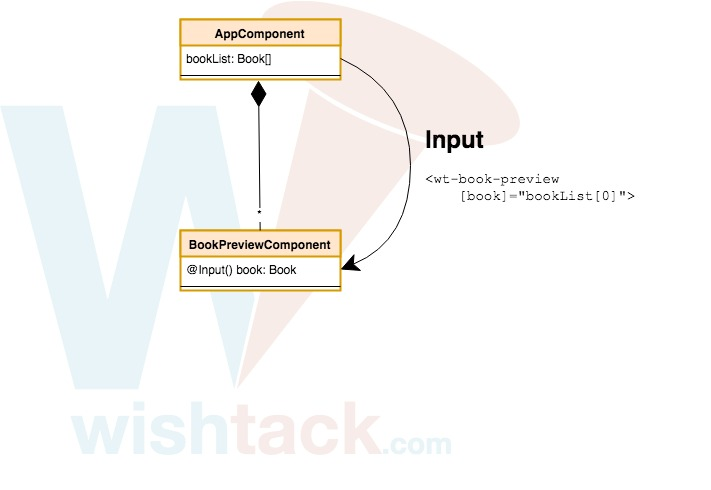

# Input

## 1. Property Binding

Pour transmettre des données à un "child component", nous allons communiquer avec ce dernier de la même façon que nous contrôlons les propriétés d'un élément natif, c'est à dire à l'aide du [Property Binding](../composants/property-binding.md) :

```markup
<wt-book-preview [book]="bookList[0]"></wt-book-preview>
```

On obtient alors un "set" implicite de la propriété `book` de l'instance du composant `BookPreviewComponent.`



```typescript
bookPreviewComponent.book = this.bookList[0];
```




Remarquez la similarité avec le [Property Binding](../composants/property-binding.md) sur des éléments natifs.

```markup
<button [disabled]="!isEnabled">
```

```typescript
button.disabled = !this.isEnabled;
```


## 2. Déclaration de la propriété

Avec le code précédent, nous obtenons l'erreur suivante :

```text
Template parse errors:
Can't bind to 'book' since it isn't a known property of 'wt-book-preview'.
1. If 'wt-book-preview' is an Angular component and it has 'book' input, then verify that it is part of this module.
2. If 'wt-book-preview' is a Web Component then add 'CUSTOM_ELEMENTS_SCHEMA' to the '@NgModule.schemas' of this component to suppress this message.
3. To allow any property add 'NO_ERRORS_SCHEMA' to the '@NgModule.schemas' of this component.
```

En effet, le composant book-preview n'a pas de propriété `book`. Il faut donc la déclarer :



```typescript
...
export class BookPreviewComponent {
    book: Book;
}
```



... mais heureusement, cela ne suffit pas et nous obtenons toujours la même erreur.

## 3. Décorateur `@Input()`

Par défaut, aucune propriété de composant ne peut être modifiée par [Property Binding](../composants/property-binding.md). Il faut donc définir les propriétés pouvant servir d' "input" au composant en ajoutant simplement le décorateur `@Input()`.



```typescript
import { Input } from '@angular/core';

...
export class BookPreviewComponent {
    @Input() book: Book;
}
```



Voyez ce décorateur comme un contrôle vous permettant de définir la visibilité d'une propriété d'un composant.


N'oubliez pas les parenthèses !

En réalité, `Input` est une "factory" qui retourne un décorateur. Si vous l'utilisez comme décorateur `@Input book`, elle n'aura aucune action et ne fonctionnera donc pas.


## Résultat



```typescript
...
export AppComponent {
    bookList = [
        new Book({
            title: 'eXtreme Programming Explained'
        }),
        new Book({
            title: 'ReWork'
        })
    ];
}
```





```markup
<wt-book-preview
        *ngFor="let book of bookList"
        [book]="book"></wt-book-preview>
```





```typescript
...
export class BookPreviewComponent {
    @Input() book: Book;
}
```





```markup
<div>{{ book.title }}</div>
```





