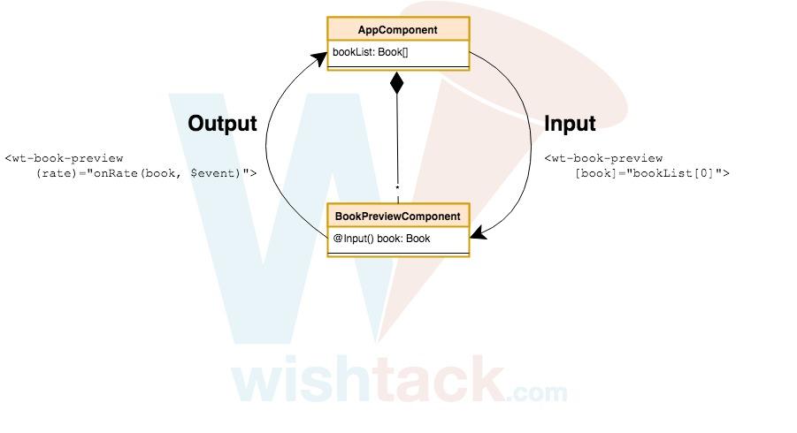

# Output

## 1. Event Binding

De la même façon que les [Inputs](input.md) permettent de communiquer des données à un "child component", ce dernier peut transmettre des données au "parent component" via un mécanisme d'"Output" similaire à l'[Event Binding](../composants/event-binding.md) utilisé précédemment pour capturer des événements natifs.

```markup
<wt-book-preview (rate)="onRate($event)"></wt-book-preview>
```

Nous avons inscrits l'expression `onRate($event)` comme "listener" de l'événement `rate`.



```typescript
bookPreviewComponent.rate
    .subscribe((rating) => {
        this.onRate(rating);
    });
```




Remarquez la similarité avec l'[Event Binding](../composants/event-binding.md) sur des événements DOM.

```markup
<button (click)="buy()">BUY</button>
<div (drop)="onDrop($event)"></div>
```



```typescript
button.addEventListener('click', () => this.buy());
div.addEventListener('drop', (dropEvent) => this.onDrop(dropEvent));
```





Contrairement aux [Inputs](input.md), si l'"output" n'est pas déclaré correctement, Angular ne produira aucune erreur. Dans ce cas, Angular inscrit notre "listener" à un événement DOM qui n'existe pas et qui ne se produit donc jamais ; notre "listener" ne sera alors simplement jamais appelé.


## 2. Déclaration de la propriété et décorateur `@Output()`

En déclarant simplement la propriété `rate` sur le composant `book-preview` :



```typescript
...
export class BookPreviewComponent {
    rate;
}
```



... il ne se passe rien mais par analogie avec les [Inputs](input.md), il faut ajouter le décorateur `@Output()` :



```typescript
import { Output } from '@angular/core';

...
export class BookPreviewComponent {
    @Output() rate;
}
```



... et nous remarquons alors une erreur très intéressante :

```text
TypeError: Cannot read property 'subscribe' of undefined
```

Comme indiqué précédemment, avec l'[Event Binding](../composants/event-binding.md), si Angular trouve un "output" du même nom, il ajoute un listener dessus avec la méthode `subscribe`. On remarque donc qu'Angular s'attend à ce que les "Outputs" soient des objets qui définissent la méthode `subscribe` _\(ou alors quelque chose de similaire à des instances d'"Observables". Cf. RxJS.\)_.

## 3. Initialisation de la propriété avec `EventEmitter`

Il faut donc initialiser la propriété. Nous pourrions initialiser la propriété avec n'importe quel `Observable` mais dans la pratique nous utiliserons la classe Angular `EventEmitter` _\(qui hérite de la classe Subject d'RxJS qui elle même hérite de la classe `Observable` d'RxJS\)_.



```typescript
export class BookPreviewComponent {
    @Output() rate = new EventEmitter();
}
```




`EventEmitter` est une classe générique et il est recommandé de la typer pour éviter d'émettre des valeurs du mauvais type par erreur ou plus simplement pour indiquer à l'utilisateur du composant le type de données émises par l'"Output" dès la première lecture.

```typescript
@Output() rate = new EventEmitter<number>();
```



Faites attention à bien importer la bonne classe `EventEmitter`.



## 4. Emission de valeurs

Comme son nom l'indique, un `EventEmitter` permet d'émettre des valeurs. Il peut donc être utilisé n'importe où dans la classe `BookPreviewComponent` pour remonter des valeurs au composant parent via la méthode `emit`.



```typescript
export class BookPreviewComponent {

    @Output() rate = new EventEmitter<number>();
    
    iLoveIt() {
        this.rate.emit(5);
    }
    
}
```





```markup
<button (click)="iLoveIt()">I LOVE IT</button>
```





