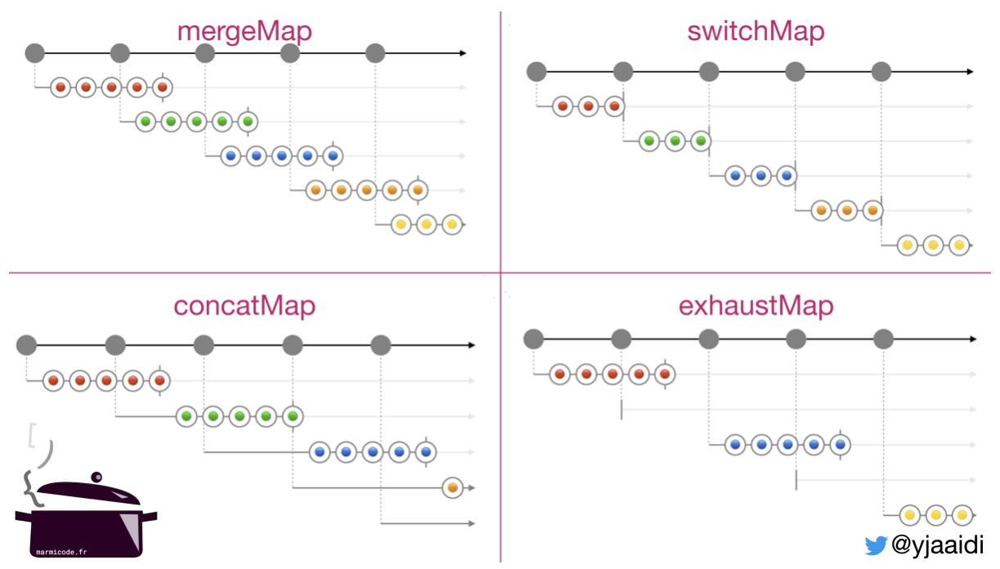

# Talks

### Practice makes Perfect when it comes to RxJS

[https://youtu.be/EG-QSlQ0p1s](https://youtu.be/EG-QSlQ0p1s)



### I switched a map... with Shai Reznik

[https://youtu.be/rUZ9CjcaCEw?t=479](https://youtu.be/rUZ9CjcaCEw?t=479)



## Flattening Strategies



