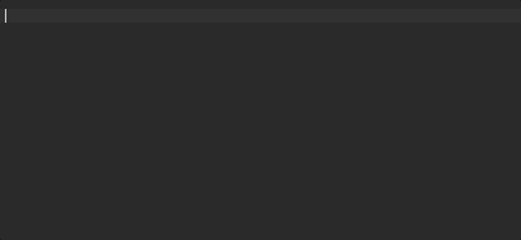

# Définition d'un Module

Angular propose un concept de modules afin de mieux structurer le code et faciliter la réutilisation et le partage.


Attention à ne pas confondre les **modules Angular** avec les **modules ES2015 / TypeScript**.


Un module Angular est un mécanisme permettant de :

* regrouper des composants _\(mais aussi des services, directives, pipes etc...\),_
* définir leurs dépendances,
* et définir leur visibilité.

Un module Angular est défini simplement avec une classe _\(généralement vide\)_ et le décorateur `NgModule`.



```typescript

import { NgModule } from '@angular/core';

import { PictureModule } from '../picture/picture.module';
import { BookPreviewComponent } from './book-preview/book-preview.component';

@NgModule({
    declarations: [
        BookPreviewComponent
    ],
    exports: [
        BookPreviewComponent
    ],
    imports: [
        HttpModule,
        PictureModule
    ]
})
export class BookModule {
}
```



## `declarations`

Définit la liste des composants _\(ou directives, pipes etc...\)_ contenus dans ce module.

## `exports`

Définit la liste des composants pouvant être utilisés par les modules qui importent celui-ci.


Les composants non-exportés ne peuvent être utilisés que par les composants contenus dans le module.



Pour exporter un composant lors de sa génération par Angular CLI, il faut ajouter l'option `--export` : `yarn ng generate component --export book/book-preview`.

Pour éviter de lutter contre les oublis, une astuce consiste à **ajouter un "script" à votre fichier `package.json`** pour **unifier la façon de générer vos composants**.




```javascript
{
    "scripts": {
        "generate:component": "ng generate component --export"
    }
}
```



```bash
yarn generate:component book/book-preview
```

## `imports`

Définit la liste des dépendances du module. Il s'agit généralement de la liste des modules contenant les composants utilisés par les composants de la section [`declarations`](definition-dun-module.md#declarations).


## Bonnes Pratiques


La convention est de regrouper tous les composants dans le même dossier que le module.

```text
book/
    book.module.ts
    book-preview/
        book-preview.component.ts
        book-preview.component.html
    ...
```



Evitez les sous-arborescences _\(définition de modules à l'intérieur d'autres modules etc...\)._

**Flat is better than nested.**



## Angular CLI - Generate Module

Vous pouvez générer un module avec la commande suivante :

```bash
yarn ng generate module book
```

## Live Template

Pensez à utiliser des "live templates" sur votre IDE !



