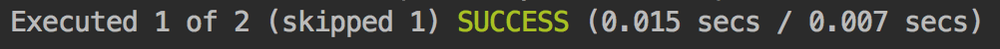

# Test-Driven Development

## Pourquoi ?

L'approche T.D.D. _\(Test-Driven Development\)_ consiste à **implémenter les tests en premier**.

Cela offre les avantages suivants :

* Lors de l'implémentation du test, **on se concentre sur la fonctionnalité** et son utilisation **plutôt que sur les contraintes liées à son développement**. Autrement dit, **on se concentre sur ce que l'on veut** faire **plutôt que sur ce que l'on peut** faire. Cela évite par exemple l'utilisation de librairies inadaptées. 
* Le T.D.D. **encourage naturellement** l'adoption d'**architectures simples, modulaires et découplées** afin de **simplifier l'implémentation des tests**. On obtient alors une meilleure architecture et un code moins monolithique et plus facile à maintenir. 
* Les interfaces **peuvent être générées** à partir des tests. 
* Quand les tests passent, on sait que la fonctionnalité est opérationnelle. 
* Le développement est **plus rapide** car la vérification des résultats est instantanée et automatique.

## Le "Test-Driven Development" Etape par Etape

### 1. Définition du Test

Grâce à la fonction `xit` de [Jasmine](jasmine.md), on peut décrire une "spec" et l'exclure tant que la fonctionnalité n'est pas implémentée.

```typescript
describe('Calculator', () => {

    xit('should evaluate 2 + 3 + 4 to 9', () => {
        // @TODO implement this.
    });

});
```


**Ce code peut être "commit" et  "released".**





Les tests désactivés sont affichés sur les rapports.



Par précaution, nous pouvons lever une exception dans le test pour éviter qu'il ne soit activé par erreur et que cela donne l'impression d'un test qui fonctionne.

```typescript
describe('Calculator', () => {

    xit('should evaluate 2 + 3 + 4 to 9', () => {
        throw new NotImplementedError();
    });

});
```

La classe `NotImplementedError` peut être implémentée ainsi.

```typescript
export class Exception {

    constructor(private _message: string) {
    }
    
    toString() {
        return this._message;
    }
    
}

export class NotImplementedError extends Exception {

    constructor() {
        super('Not implemented!');
    }

}
```


### 2. Implémentation du Test



```typescript
describe('Calculator', () => {

    it('should evaluate 2 + 3 + 4 to 9', () => {

        const calculator = new Calculator();

        expect(calculator.evaluate('2 + 3 + 4')).toEqual(9);

    });

});
```



**Un test désactivé sera** tout de même **compilé** par TypeScript.

Grâce à l'IDE, on peut générer les classes et fonctions sans les implémenter.


### 3. Implémentation de la Fonctionnalité

