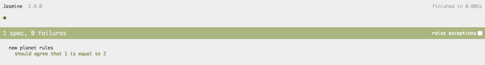

# Unit-Test Asynchrone

## "Async Gotcha"

```typescript
describe('new planet rules', () => {

    it('should agree that 1 is equal to 2', () => {

        setTimeout(() => {
            expect(1).toEqual(2);
        });

    });

});
```

### WTF !? 🤔



La fonction de "callback" associée au `setTimeout` **n'est appelée qu'au prochain "tick", après l'exécution de la "spec"**.  
**L'assertion est donc ignorée** car [Jasmine](jasmine.md) n'arrive à l'associer à aucun test.

## Solution n°1 : Fonction `done` 👎

Pour **indiquer à Jasmine que la "spec" est asynchrone**, il faut ajouter le **paramètre `done`** à la fonction de "spec".

```typescript
describe('new planet rules', () => {

    it('should agree that 1 is equal to 2', (done) => {
        // Nothing 😪
    });

});
```

On obtient alors l'erreur suivante :

```text
Timeout - Async callback was not invoked within timeout specified by jasmine.DEFAULT_TIMEOUT_INTERVAL.
```


Par défaut, la variable `jasmine.DEFAULT_TIMEOUT_INTERVAL` vaut **5 secondes**.

**N'augmentez jamais cette valeur !**

Un test unitaire doit être F.I.R.S.T. :

* **Fast**  
* **Independent**  
* **Repeatable**  
* **Self-Validating**  
* **Thorough & Timely**


La fonction `done` doit être **appelée explicitement** à la fin de la "spec".

```typescript
describe('new planet rules', () => {

    it('should agree that 1 is equal to 2', (done) => {

        setTimeout(() => {
            expect(1).toEqual(2);
            done();
        });

    });

});
```

Cette fois-ci, la "spec" **échoue** rapidement à cause de l'assertion.


Cette approche s'avère rapidement **pénible** à mettre en place et surtout "**Error-Prone**".

Elle finit rapidement en [Callback Hell](../../callback-hell-vs.-promise-vs.-async-await/callback-hell.md) et "Race Conditions".


## Solution n°2 : `Promise` et `async / await` ✌️

Plutôt que d'utiliser la fonction `done`, la fonction de "spec" peut **retourner une `Promise` dont la résolution signale la fin**.

```typescript
describe('new planet rules', () => {

    it('should not affect arithmetic rules', () => {

        const promise1 = new Promise(resolve => {

            setTimeout(() => {
                expect(1).not.toEqual(2);
                resolve();
            });

        });

        const promise2 = new Promise(resolve => {

            setTimeout(() => {
                expect(1).not.toEqual(3);
                resolve();
            });

        });

        return Promise.all([promise1, promise2]);

    });

});
```

Plus simple et plus sexy, il est possible d'utiliser [`async / await`](../../callback-hell-vs.-promise-vs.-async-await/async-await.md).

```typescript
describe('new planet rules', () => {

    it('should not affect arithmetic rules', async () => {

        await new Promise(resolve => {

            setTimeout(() => {
                expect(1).not.toEqual(2);
                resolve();
            });

        });

        await new Promise(resolve => {

            setTimeout(() => {
                expect(1).not.toEqual(3);
                resolve();
            });

        });

    });

});
```

## Solution n°3 : Fonction `async()` 🤟

La fonction Angular `async` _\(à ne pas confondre avec la syntaxe ECMAScript `async / await`\)_ est une fonction **dédiée aux tests Angular**.

En créant une "Zone" _\(Cf._ [_Zone.JS_](https://github.com/angular/zone.js/)_\)_ autour de la "spec" et grâce au "Monkey Patching" de toutes les sources d'exécution asynchrone _\(`setTimeout` etc...\)_, **la fonction `async` retourne une fonction de "spec" asynchrone** et **appelle la fonction `done`** quand **tous les traitements asynchrones détectées sont terminés** _\(i.e. la queue de l'Event Loop et vide et plus aucun traitement en attente\)_.

```typescript
import { async } from '@angular/core/testing';

describe('new planet rules', () => {

    it('should not affect arithmetic rules', async(() => {

        setTimeout(() => {
            expect(1).not.toEqual(2);
        });

    }));

});
```

### Avantages

Cette approche a pour avantage :

* d'être **simple d'utilisation**,
* d'être **moins "Error-Prone"** que les approches précédentes,
* de garantir que Jasmine **ne passera à la "spec" suivante** que **quand tous les traitements asynchrones seront terminés**.

### Limitations

Testons cette station météo capricieuse :



```typescript
import { Observable, timer } from 'rxjs';
import { filter, map, mapTo } from 'rxjs/operators';

class PickyWeatherStation {

    getTemperature(city): Observable<number> {

        return timer(1000)
            .pipe(
                mapTo(city),
                filter(_city => _city !== 'Paris'),
                map(_city => 100 / _city.length)
            );

    }

}
```





```typescript
describe('PickyWeatherStation', () => {

    let weatherStation: PickyWeatherStation;

    beforeEach(() => {
        weatherStation = new PickyWeatherStation();
    });

    it('should give temperature', async(() => {

        weatherStation.getTemperature('Paris')
            .subscribe(temperature => {
                expect(temperature).toEqual(-10);
            });

    }));

});
```



**Bien que l'assertion `expect(temperature).toEqual(-10)` soit erronée, la "spec" réussit.**


En effet, le "pipe" `filter(_city => _city !== 'Paris')` ignore la valeur émise par l'`Observable` `of(city)` dans ce cas ; **on obtient alors un `Observable` qui "complete" sans émettre aucune valeur**.

**La fonction `async` ne détecte donc aucun traitement en attente** et **la "callback" du premier `subscribe`** **n'est jamais appelée**.



Ce problème pourrait être résolu en utilisation la fonction `done` mais il est **dommage d'attendre une seconde de délai** due au "pipe" `delay(1000)`.


## Solution n°4 : Fonction `fakeAsync()` 💪

La fonction Angular `fakeAsync` permet de **contrôler l'"Event Loop" et le "Timer" 🎉**.

Elle utilise également une "Zone" _\(Cf._ [_Zone.JS_](https://github.com/angular/zone.js/)_\)_ mais contrairement à la fonction `async`, celle-ci **n'attend pas la fin d'exécution des traitements asynchrones** mais **déclenche des erreurs à la fin de la "spec"** si des traitements sont encore en attente.

```typescript
import { fakeAsync } from '@angular/core/testing';

...

    it('should give temperature', fakeAsync(() => {

        weatherStation.getTemperature('Paris')
            .subscribe(temperature => {
                expect(temperature).toEqual(-10);
            });

    }));
```

La "spec" s'exécute plus rapidement car **elle n'attend pas le délai d'une seconde** mais **elle produit rapidement l'erreur suivante** :

```text
1 periodic timer(s) still in the queue.
```

### `tick()` & `flush()`

La fonction `fakeAsync` est accompagnée des deux fonctions `tick` et `flush` qui permettent de contrôler la "Fake Event Loop" créée par la fonction `fakeAsync`.

#### `tick()`

La fonction `tick` permet de **déclencher le prochain traitement en attente dans la "queue"** de l'"Event Loop" :

```typescript
    it('should trigger next tick', fakeAsync(() => {

        let value;

        setTimeout(() => value = 'VALUE');

        tick();

        expect(value).toEqual('VALUE');

    }));
```

#### `tick(ms)`

La fonction `tick` permet également de **simuler l'attente** en lui donnant en paramètre le nombre de millisecondes à simuler.

```typescript
it('should control time', fakeAsync(() => {

    let value;

    setTimeout(() => value = 'VALUE', 1000);

    tick(999);

    expect(value).toEqual(undefined);

    tick(1000);

    expect(value).toEqual('VALUE');

}));
```

#### `flush()`

Et finalement, la fonction `flush` **déclenche les \(ou le\) traitements en attente** et **retourne la valeur en millisecondes du temps d'attente simulé**.

```typescript
it('should trigger next tick', fakeAsync(() => {

    let valueList = [];

    setTimeout(() => valueList = [...valueList, 'WISH'], 1000);
    setTimeout(() => valueList = [...valueList, 'TACK'], 2000);

    expect(valueList).toEqual([]);

    const duration = flush();

    expect(valueList.join('')).toEqual('WISHTACK');

    expect(duration).toEqual(2000);

}));
```

Grâce à la fonction `fakeAsync`, on peut donc remédier aux limitations associées à la fonction `async` ainsi :

```typescript
it('should give temperature', fakeAsync(() => {

    let temperature;

    weatherStation.getTemperature('Paris')
        .subscribe(_temperature => temperature = _temperature);

    tick(1000);

    expect(temperature).toBe(20);

}));
```


Le test échoue alors car la "callback" n'a pas été appelée et `temperature` vaut donc `undefined`.



Les méthodes `fakeAsync`, `tick` et `flush` sont généralement stables mais tout de même considérées comme expérimentales.

En effet, dans le dernier exemple, la fonction `flush` ne fonctionne pas car il existe des **incompatibilités avec certains `Observable`s et opérateurs RxJS** manipulant le timer _\(par manque de Monkey Patching ?\),_ Cf. _\__[_https://github.com/angular/angular/issues/10127_](https://github.com/angular/angular/issues/10127).\_


#### Detection des effets de bord


On pourrait recommander de **déclarer toutes les "specs" avec la fonction** **`fakeAsync`** afin d'**éviter tout effet de bord** dû à des traitements asynchrones ignorés par le test.


