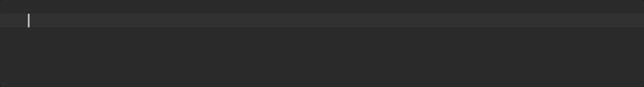

# Unit-Test d'un Service

Il serait dommage de ne pas profiter de la [Dependency Injection](../../dependency-injection/) lors de l'implémentation des tests unitaire.

## `TestBed.get` 👍

La méthode statique **`TestBed.get`** permet d'**injecter les services** dans les tests unitaires.

```typescript
describe('PickyWeatherStation', () => {

    it('should give temperature', fakeAsync(() => {

        const weatherStation: PickyWeatherStation = TestBed.get(PickyWeatherStation);

        let temperature;

        weatherStation.getTemperature('Lyon')
            .subscribe(_temperature => temperature = _temperature);

        expect(temperature).toBe(42);

    }));

});
```


Pour éviter de récupérer l'instance dans chaque "spec", pensez à utiliser la fonction `beforeEach`!

```typescript
let weatherStation: PickyWeatherStation;
beforeEach(() => weatherStation = TestBed.get(PickyWeatherStation));
```


Pensez à définir un "Live Template" dans l'IDE.



## `inject` 👎

La fonction `inject` _\(du module `@angular/core/testing`\)_ permet également d'injecter des services dans les tests unitaire.

Cette fonction prend deux paramètres :

* **la liste des tokens à injecter** _\(généralement liste des classes à injecter\),_
* **une fonction de "callback"** qui prend en paramètre **la liste des services injectés** dans le même ordre que la liste de tokens.


Attention à **ne pas confondre la fonction `inject`** du module **`@angular/core/testing`** avec celle du module **`@angular/core`** qui sert à injecter des services dans les factories `factory: () => new MyService(inject(MyDep))` _\(Cf._ [_https://github.com/angular/angular/blob/master/packages/examples/core/di/ts/injector\_spec.ts\#L70_](https://github.com/angular/angular/blob/master/packages/examples/core/di/ts/injector_spec.ts#L70)_\)_.




```typescript
@Injectable({
    providedIn: 'root'
})
class PickyWeatherStation {

    getTemperature(city): Observable<number> {
        return of(42);
    }

}
```





```typescript
describe('PickyWeatherStation', () => {

    let weatherStation: PickyWeatherStation;

    beforeEach(inject([PickyWeatherStation], _weatherStation => weatherStation = _weatherStation));

    it('should give temperature', fakeAsync(() => {

        let temperature;

        weatherStation.getTemperature('Lyon')
            .subscribe(_temperature => temperature = _temperature);

        expect(temperature).toBe(42);

    }));

});
```




La fonction `inject` peut être utilisée **directement autour de la fonction de "spec"** mais il est généralement plus simple d'ajouter un **`beforeEach` pour chaque service** afin d'éviter les problèmes liés à l'ordre des tokens d'injection et le refactoring en général.


