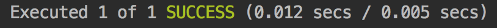
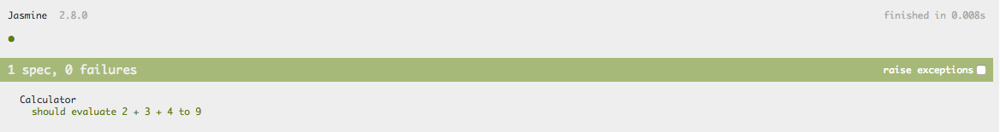

# Unit-Test Synchrone

## Ajout d'un Test

Pour ajouter un test, il suffit de créer un fichier avec l'extension `.spec.ts` dans le dossier `src`. Plus exactement, **la convention est de créer ce fichier dans le même dossier que le fichier contenant le code source à tester**.

Il suffit d'utiliser les 3 fonctions suivantes pour implémenter un premier test : 

* `describe` : pour définir une suite _\(ou groupe\)_ de "specs".
* `it` : pour définir une "spec" _\(ou un test\)_.
* `expect` : pour implémenter les assertions.



```typescript
import { Calculator } from './calculator';

describe('Calculator', () => {

    it('should evaluate 2 + 3 + 4 to 9', () => {

        const calculator = new Calculator();

        expect(calculator.evaluate('2 + 3 + 4')).toEqual(9);

    });

});
```







## `beforeEach` & `afterEach`

Comme dans tous les frameworks de tests unitaires, on peut définir des logique de "**setup**" et de "**tear down**" avec respectivement les fonctions `beforeEach` et `afterEach`.

* **`beforeEach`** : permet d'inscrire une fonction de "setup" qui sera appelée avant chaque "spec". Les fonctions de "setup" permettent de **préparer un environnement sain** pour chaque "spec". 
* **`afterEach`** : permet d'inscrire une fonction de "tear down" qui sera appelée après chaque "spec". Les fonctions de "tear down" permettent de **nettoyer l'environnement** ou encore **exécuter des assertions** pour s'assurer que les "tests" n'ont pas d'effets de bord _\(requête HTTP "mocked" non exécutées ou sans réponse\)_.

A titre d'exemple, nous pouvons utiliser `beforeEach` afin de **factoriser l'instanciation** de la classe `Calculator` et surtout d'avoir **une nouvelle instance pour chaque "spec"**.



```typescript
import { Calculator } from './calculator';
​
describe('Calculator', () => {

    let calculator: Calculator;

    beforeEach(() => {
        calculator = new Calculator();
    });
​
    it('should evaluate 2 + 3 + 4 to 9', () => {
        expect(calculator.evaluate('2 + 3 + 4')).toEqual(9);​
    });
​
});
```




Les fonctions `beforeEach` et `afterEach` peuvent être appelées plus d'une fois afin de définir **plusieurs fonctions de "setup" et de "tear down"**.  
Ces fonctions seront **appelées dans l'ordre** de déclaration.


