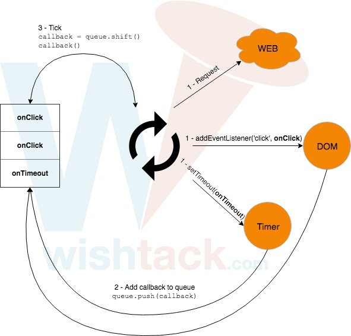

# Event Loop

## Comportement de l'Event Loop

Quel est l'ordre d'exécution ?



```javascript
var value;

setTimeout(function () {
    value = 'VALUE';
}, 100 /* 100 ms. */);

console.log(value); // ???

setTimeout(function () {
    console.log(value); // ???
}, 200);
```



```javascript
var value;

setTimeout(function () {
    value = 'VALUE';
}, 100 /* 100 ms. */);

console.log(value); // 1 - undefined

setTimeout(function () {
    console.log(value); // 2 - VALUE
}, 200);
```



Et dans ce cas ?



```javascript
function main() {

    var value;

    setTimeout(function () {
        value = 'VALUE';
    }, 0 /* 0 ms. */);

    console.log(value); // ???

    setTimeout(function () {
        console.log(value); // ???
    }, 0);
    
    console.log(value); // ???

}

main();
```



```javascript
function main() {

    var value;

    setTimeout(function () {
        value = 'VALUE';
    }, 0 /* 0 ms. */);

    console.log(value); // 1 - undefined

    setTimeout(function () {
        console.log(value); // 3 - VALUE
    }, 0);
    
    console.log(value); // 2 - undefined
    
}

main();
```



## Fonctionnement de l'Event Loop

1. **Inscription d'un listener** : Tous les traitements asynchrones nécessitent la définition d'une fonction de callback afin de récupérer le résultat du traitement ou simplement savoir que le traitement a abouti. Lors de cette étape, nous inscrivons explicitement ou indirectement un listener \(notre callback\) sur un événement. Exemples: `setTimeout`, `addEventListener` etc... 
2. **Ajout de la fonction à la queue** : Cette fonction de callback ne peut pas être appelée immédiatement dès réception du résultat car le thread est probablement occupé par l'exécution d'une autre fonction. Dans notre cas, nos deux fonctions de callback sont prêtes à être appelées mais le thread est occupé par l'exécution de notre fonction `main`. Le moteur JavaScript ajoute donc les fonctions de callback à la fin d'une "queue" de fonctions à appeler quand le thread sera libre. 
3. **Tick** : A la fin de l'exécution de la fonction `main`, le thread n'a pas le temps de s'ennuyer et va récupérer la fonction en tête de "queue" pour l'exécuter. Plus précisément, il s'agit ici de l'"event loop" qui est simplement la boucle infinie qui lance les fonctions les unes après les autres. **L'instant où l'"event loop" récupère une nouvelle fonction à exécuter s'appelle un "tick".**








