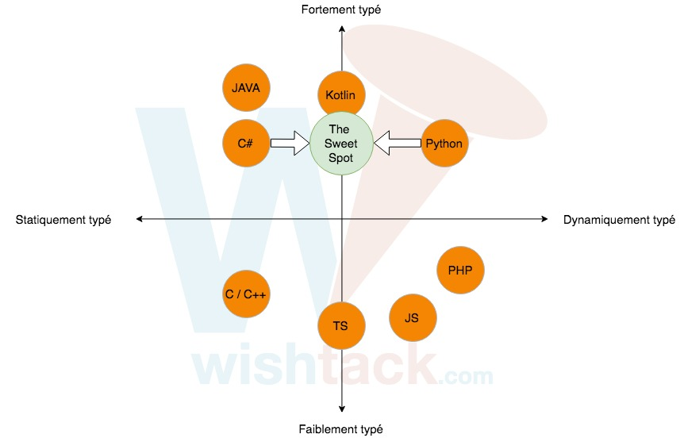

# Propriétés du Langage

## Typage

JavaScript est un langage **dynamiquement** et **faiblement** typé.

## JavaScript est un langage multi-paradigme

* Programmation fonctionnelle.
* Programmation orientée objet.
* Programmation reactive.

## JavaScript est cross-browser et cross-platform

