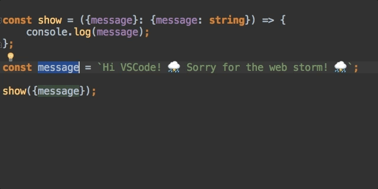
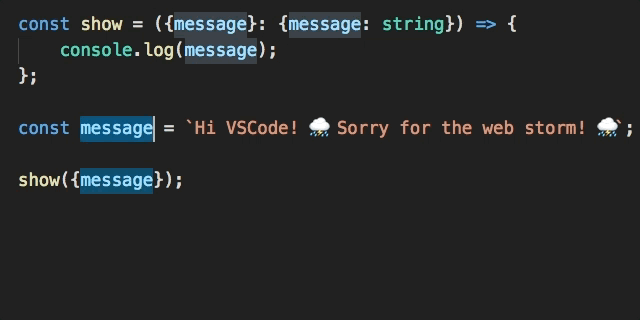

# Object Literal Property Value Shorthand

Il arrive souvent que le nom d'une propriété d'un "Object Literal" porte le même nom que la variable qui y sera associée : `{firstName: firstName}`.

Cela produit de la redondance :

```javascript
const firstName = 'Foo';
const lastName = 'BAR';

const user = {
    firstName: firstName,
    lastName: lastName,
    email: 'foo.bar@wishtack.com'
};
```

... mais grâce à la syntaxe "Object Literal Property Value Shorthand", on peut alléger le code :

```javascript
const firstName = 'Foo';
const lastName = 'BAR';

const user = {
    firstName,
    lastName,
    email: 'foo.bar@wishtack.com'
};
```


A vous de définir votre style guide à ce sujet dans votre équipe.

Si l'écosystème JavaScript est nouveau pour l'équipe, il vaut mieux éviter ce genre de raccourcis.



Méfiez-vous des éditeurs qui n'arrivent pas à "refactor" les "object shorthands".

Chez Wishtack, nous nous sommes interdits leur utilisation jusqu'au support de ce refactoring par IntelliJ / WebStorm.








