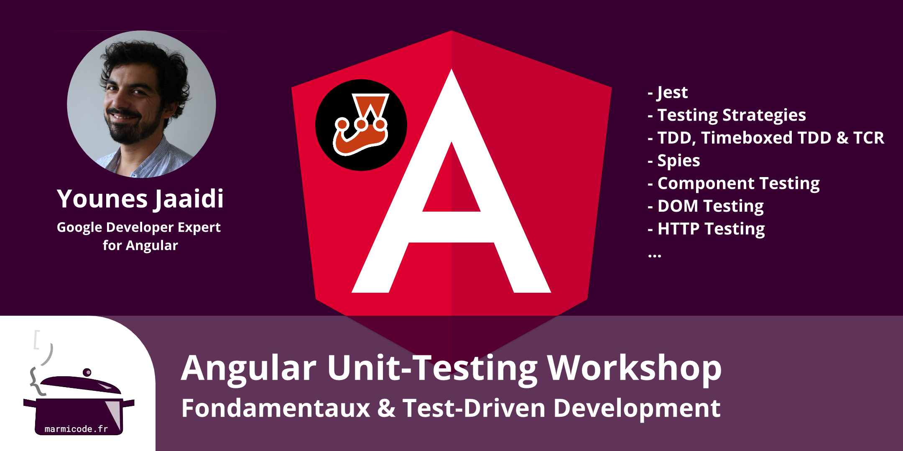

# Atelier Unit-Testing Angular

L’unit-testing ou plus particulièrement l’unit-testing front-end est indéniablement dans le top 3 des sujets les plus complexes associés au développement d’applications Angular.

Face à cette complexité, il est tentant de renoncer mais à quel prix ? Certes, il est possible de développer une application sans tests unitaires mais est-ce réellement plus rapide ? Qu’advient-il de la maintenabilité du code quelques mois ou à peine quelques semaines plus tard ? Pourrons-nous refactoriser l’application et la déployer régulièrement en toute sérénité au fur et à mesure qu’elle se complexifie et qu’elle vieillit entre nos mains ?

Ce workshop présente à travers des exercices pratiques, des techniques pragmatiques d’unit-testing de composants et de services Angular. Vous y découvrirez également **comment écrire des tests compréhensibles, maintenables et surtout rentables**.

## Objectifs

Lors de ce workshop, vous apprendrez à :

* implémenter des tests unitaires pour vos applications Angular avec l’approche **Test-Driven Development**,
* choisir **le bon type de tests** à implémenter en fonction du contexte,
* **découpler** les tests du code pour faciliter le refactoring,
* implémenter des tests unitaires **maintenables** et **compréhensibles**.

## Réservation / Information

https://marmicode.eventbrite.fr



...ou contactez-nous sur [camijote@marmicode.fr](mailto:camijote@marmicode.fr) et appelez-nous au [+33 4 26 83 61 92](tel:+33426836192) pour toutes vos questions.

### Déroulement de la journée

* **9h00** : Début de l'atelier.
* **12h30 - 14h** : Déjeuner.
* **17h30** : Fin de l'atelier
* **17h30 - 19h** : Apéro-discute.

### Le Lieu

Le lieu reste à définir en fonction du nombre de participants.

## Prérequis

* **Curiosité** et **bonne culture Web**.
* Familiarité avec l’écosystème Angular _\(e.g. savoir créer des composants, implémenter et utiliser des Inputs / Outputs\)._
* Un ordinateur portable.

## Programme

### Introduction au testing

* Pourquoi tester ?
* Les différentes types de test.
* Un exemple de test unitaire.

### Stratégie de testing

* Que faut-il tester et comment ?
* Définition d'une unité de code.
* Classicists vs Mockists.
* Exercice : Implémentation d’un premier test unitaire.
* Debugging avec Karma.

### Jest

* Avantages et inconvénients.
* Mise en place de Jest.
* Debugging avec Jest.

### Test-Driven Development

* Origines et intérêt du Test-Driven Development.
* Tips & tricks.
* **Exercice Bonus** : Timeboxed TDD & TCR.

### Service Testing

* **Exercice** : Implémenter un service avec une approche pilotée par les tests \(ou Test-Driven Development\).

### Mocks, Spies & Stubs

* Mocks vs Spies vs Stubs.
* Surcharge de l’injection de dépendance Angular.
* **Exercice** : Simuler le comportement d’une dépendance avec des Mocks, Spies & Stubs.

### Component Testing

* Implémentation de tests unitaires pour un composant.
* Les différents types de tests de composants : Integration vs Shallow vs Isolated.
* Interaction avec le DOM.
* **Exercice** : Integration testing d’un composant.
* **Exercice** : Shallow testing.
* **Exercice** : Testing des échanges à base d’Inputs & Outputs.

### Http Testing

* Mocking des échanges HTTP.

## Votre Formateur

Younes est formateur, coach en eXtreme Programming et **Google Developer Expert** en Angular et Web Technologies.

Après 10 ans d’expérience en développement web, Younes est convaincu que la qualité d’un produit repose principalement sur le **Collective Ownership** et la **qualité de code**. Son but est de propager cette culture de partage et d’améliorer la qualité des produits par l’échange et le levier de la Developer eXperience.

Depuis plus de 5 ans et avec un focus autour d'Angular, Younes forme et accompagne des équipes allant de jeunes startups aux institutions européennes en passant par des banques ou sociétés de service.

Il est également l’auteur de ce guide... **et prend parfois le temps d’aller bavarder aux meetups et conférences sur différents sujets tels que** [**Les Composants Interchangeables à l’AngularConnect**](https://youtu.be/nX_HhiqmFAI) ****ou [**le Limbo à l'AngularUp**](https://www.youtube.com/watch?v=izGz7H-8yIk).

