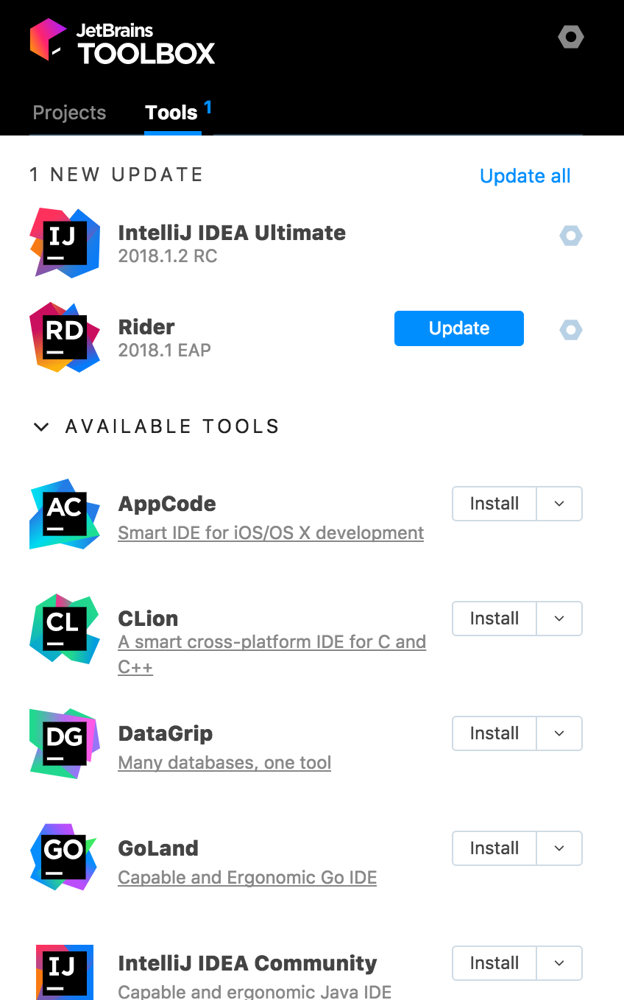

# IntelliJ / WebStorm / VSCode

## JetBrain's IntelliJ IDEA & WebStorm

[IntelliJ IDEA](https://www.jetbrains.com/idea/)  & [WebStorm](https://www.jetbrains.com/webstorm/) sont deux IDEs produits par [JetBrains](https://www.jetbrains.com/) _\(connu pour Android Studio, PyCharm, ReSharper...\)._

**IntelliJ IDEA** est un IDE Java initialement mais il dispose de plugins pour de nombreux autres langages _\(JavaScript, Python, TypeScript etc...\)._  
**WebStorm** est simplement une version limitée d'IntelliJ IDEA sans support pour le Java ou le Python par exemple.

Si vous prévoyez de travailler sur plusieurs technologies et langages, il est recommandé d'utiliser IntelliJ IDEA.

IntelliJ IDEA propose trois versions :

* **community** : open source et gratuite mais limitée en fonctionnalités,
* **ultimate** : payante mais complète,
* **EAP \(Early Access Program\)** : ou la version next et pourtant stable. Elle est proposée avec une période d'essaie de 30 jours prolongée de 30 jours à chaque mise à jour \(sachant que les mises à jours sont fréquentes 🎉\).


**IntelliJ Ultimate** ne coûte pas plus qu'un bon espresso ☕️par jour.

**WebStorm** ne coûte pas plus cher qu'un café soluble par jour.



Si vous optez pour IntelliJ plutôt que WebStorm, pensez à installer le plugin **Karma** pour pouvoir facilement "debug" les tests unitaires.


### JetBrains Toolbox



JetBrains Toolbox est un outil très pratique vous permettant d'installer et mettre à jour les outils JetBrains de votre choix. Il permet aussi un accès rapide à vos projets.

### Points forts

Les IDEs JetBrains :

* fournissent nativement de nombreux plugins pré-installés,
* proposent des recommandations et actions "intelligentes",
* proposent automatiquement des plugins adaptés à votre besoin et parfaitement préconfigurés.



## JetBrains IDE Support Chrome Extension

Extension Chrome pour "debug" vos applications en toute simplicité.

{% embed data="{\"url\":\"https://chrome.google.com/webstore/detail/jetbrains-ide-support/hmhgeddbohgjknpmjagkdomcpobmllji\",\"type\":\"link\",\"title\":\"JetBrains IDE Support\",\"description\":\"HTML/CSS/JavaScript editing and JavaScript debugging using JetBrains IDEs.\",\"icon\":{\"type\":\"icon\",\"url\":\"https://ssl.gstatic.com/chrome/webstore/images/icon\_144px.png\",\"width\":144,\"height\":144,\"aspectRatio\":1},\"thumbnail\":{\"type\":\"thumbnail\",\"url\":\"https://lh3.googleusercontent.com/sVgUfYqQYFUXVietc6jzqMa7yohb2ThmK9dU-d6aK5Ax348ef6qYeuNUEyMnfk5NPfmILbzz=w128-h128-e365\",\"width\":128,\"height\":128,\"aspectRatio\":1}}" %}

## Visual Studio Code

{% embed data="{\"url\":\"https://code.visualstudio.com/\",\"type\":\"link\",\"title\":\"Visual Studio Code - Code Editing. Redefined\",\"description\":\"Visual Studio Code is a code editor redefined and optimized for building and debugging modern web and cloud applications.  Visual Studio Code is free and available on your favorite platform - Linux, macOS, and Windows.\",\"icon\":{\"type\":\"icon\",\"url\":\"https://code.visualstudio.com/favicon.ico\",\"width\":128,\"height\":128,\"aspectRatio\":1},\"thumbnail\":{\"type\":\"thumbnail\",\"url\":\"http://code.visualstudio.com/opengraphimg/opengraph-home.png\",\"width\":1223,\"height\":630,\"aspectRatio\":0.5151267375306623}}" %}

Visual Studio Code est un éditeur de code Microsoft gratuit et open-source.

Ses points forts sont son prix et sa légèreté.

Contrairement à IntelliJ, avec Visual Studio Code, c'est à vous de rechercher et configurer les plugins qu'il vous faut.  


Pensez à mesurer le temps passé à rechercher et configurer les plugins / extensions.


