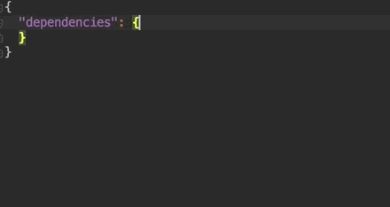

# Définition et Installation des Dépendances

Un module JavaScript _\(ou une application Angular\)_ définit toujours un fichier `package.json` à sa racine.

## `yarn init`

Si ce fichier n'existe pas, vous pouvez le créer avec la commande `yarn init`.

## `package.json` : `dependencies`

La section `dependencies` du fichier `package.json` permet de définir la liste des dépendances de votre application :

```javascript
{
    ...
    "dependencies": {
        "core-js": "^2.4.1",
        "rxjs": "~5.5.10"
    }
    ...
}
```

## `yarn install`

En lançant la commande `yarn install` _\(ou simplement_ `yarn`_\)_, Yarn procédera ainsi :

1. Il vérifie la présence du fichier `yarn.lock`. Si le fichier est présent, Yarn installera exactement les dépendances et sous-dépendances indiquées dans ce fichier.
2. Si la dépendance vient d'être ajoutée dans le fichier `package.json` ou si le fichier `yarn.lock` est absent _\(première installation\)_, il recherche la version la plus récente correspondant au critère indiqué : **`^2.4.1`** =&gt; **`>=2.4.1 & <3.0.0`** **`~5.5.10`** =&gt; **`>=5.5.10 & <5.6.0`**
3. Il indique la version sélectionnée et installée dans le fichier `yarn.lock`.


Les dépendances sont installées dans le dossier local `node_modules` qu'il ne faut jamais "commit".



Pensez à toujours "commit" le fichier yarn.lock et à lancer la commande yarn install, à chaque fois que vous mettez à jour votre code source. 


## `yarn add`

Pour ajouter une dépendance à votre application, il suffit de lancer la commande `yarn add` en indiquant les modules que vous souhaitez installer :

```bash
yarn add core-js rxjs rest-cache
```

Vous pouvez également indiquer la version souhaitée :

```bash
yarn add core-js rxjs@~5.5.10 rest-cache@next
```

... ou via l'IDE 😉 :




## `package.json` : `devDependencies`

Vous remarquerez rapidement la présence d'autres dépendances dans le champ `devDependencies` du fichier `package.json`.

Ces dépendances sont installées de la même façon que celles de la section `dependencies` sauf si la variable d'environnement `NODE_ENV` vaut `production` :

```bash
export NODE_ENV=production
yarn install # dev dependencies won't be installed
```

Cela sert surtout aux applications NodeJS afin d'éviter d'installer inutilement les outils de développement _\(build, automation et testing etc...\)_ en production.

Dans le cas des applications frontend, il s'avère qu'après le "build" de notre application, nous n'aurons plus besoin d'aucune dépendance.


La convention est de mettre :

* dans `dependencies`, toutes les dépendances dont une partie importante finira dans le résultat du build _\(e.g. : @angular/core, core-js, rxjs\)_. 
* et dans les `devDependencies`, toutes les dépendances utilisées pour les tâches de build, automation et testing _\(e.g. : @angular/cli, jasmine, karma, protractor, typescript\)_.


Pour ajouter des dépendances dans cette section, il suffit d'ajouter l'option `--dev` à la commande `yarn add`.

```bash
yarn add --dev karma
```


