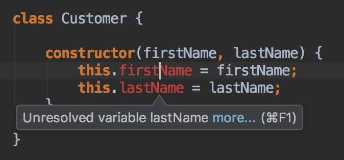

# De l'ECMAScript au TypeScript

L'ECMAScript est quasiment du TypeScript valide étant donné que le typage est optionnel.

Il est donc facile de migrer progressivement de l'ECMAScript vers le TypeScript.

## Les Propriétés

L'un des principaux changements empêchant l'ECMAScript d'être du TypeScript valide est la nécessité de déclarer les propriétés d'une classe.

En renommant simplement le fichier JavaScript en `.ts`, l'IDE commence à se plaindre.



Le compilateur TypeScript \(`tsc`\) est également mécontent.

```bash
$ tsc customer.ts
customer.ts(11,18): error TS2339: Property 'firstName' does not exist on type 'Customer'.
customer.ts(12,18): error TS2339: Property 'lastName' does not exist on type 'Customer'.
```

Le minimum syndical est donc de déclarer ces propriétés.

```typescript
class Customer {

    firstName;
    lastName;

    constructor(firstName, lastName) {
        this.firstName = firstName;
        this.lastName = lastName;
    }

}
```


La bonne pratique est de déclarer les propriétés avant le constructeur.



