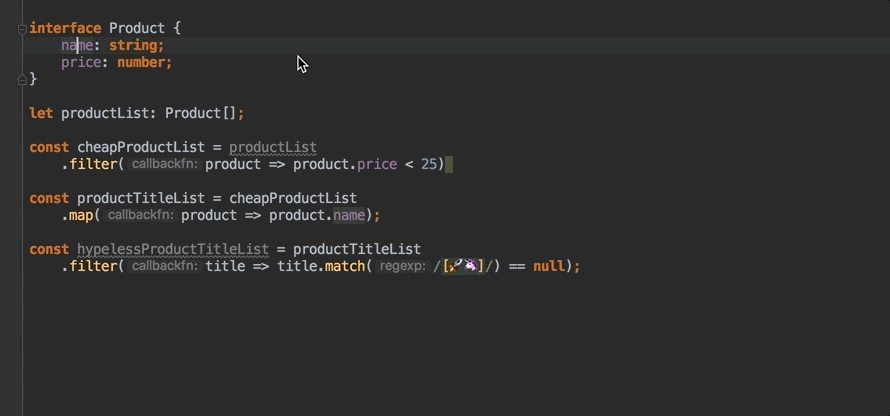
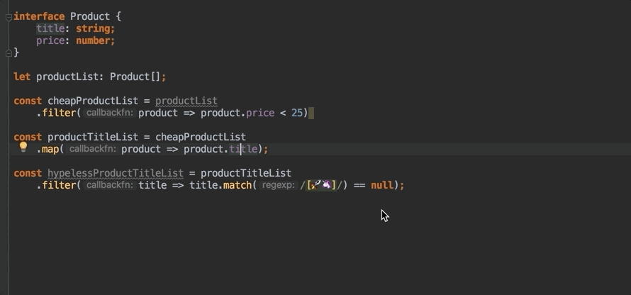

# Inference

L'inférence de type est l'un des points les plus forts et les plus sous-estimés de TypeScript.  
Il s'agit ici de **déduire implicitement le typage** et **faire gagner du temps de développement et de refactoring sans perdre en rigueur**.

L'idée de TypeScript est en quelque sorte de typer au minimum et de laisser le "transpiler" gérer le reste.

```typescript
let userName = 'Foo';

userName = 10; // error TS2322: Type '10' is not assignable to type 'string'.
```

Le type de  la variable `userName` est donc déduit à l'initialisation de la variable et il n'est donc pas nécessaire de la typer explicitement.

## Quelques exemples

```typescript
const getWeather = (city) => {

    if (city == null) {
        throw new Error(`D'OH!`);
    }

    return {
        rainProbability: 0,
        temperature: 30
    };
};

let weather = getWeather('Lyon');

// error TS2322: Type '"🔥 Wishtack is cool ! 🔥"' is not assignable
// to type '{ rainProbability: number; temperature: number; }'.
weather = '🔥 Wishtack is cool ! 🔥';
```

... ou encore :

```typescript
const getWeather = (city) => {

    if (city == null) {
        throw new Error(`D'OH!`);
    }

    return {
        rainProbability: 0,
        temperature: 30
    };
};

const getCityWeather = (city: string) => {

    const result = getWeather(city);

    return {
        ...result,
        city
    };

};

let cityWeather = getCityWeather('Lyon');

// error TS2322: Type '"🔥 Wishtack is cool ! 🔥"' is not assignable
// to type '{ city: string; rainProbability: number; temperature: number; }'.
cityWeather = '🔥 Wishtack is cool ! 🔥';
```

... au lieu de :


```typescript
interface Weather {
    rainProbability: number;
    temperature: number;
}

const getWeather = (city: string): Weather => {

    if (city == null) {
        throw new Error(`D'OH!`);
    }

    return {
        rainProbability: 0,
        temperature: 30
    };
};

interface CityWeather extends Weather {
    city: string;
}

const getCityWeather = (city: string): CityWeather => {

    const result: Weather = getWeather(city);

    return {
        ...result,
        city
    };

};

let cityWeather: CityWeather = getCityWeather('Lyon');

cityWeather = '🔥 Wishtack is hot ! 🔥';
```


... ou :

```typescript
const productList = [
    {
        title: 'Browserstack',
        price: 50
    },
    {
        title: 'Keyboard',
        price: 20
    },
    {
        title: 'Prerender',
        price: 10
    }
];

let cheapProductsTotalPrice = productList
    .filter(product => product.price < 25)
    .map(product => product.price)
    .reduce((total, price) => total + price, 0);

// error TS2322: Type '"Oups!"' is not assignable to type 'number'.
cheapProductsTotalPrice = 'Oups!';
```

... au lieu de :


```typescript
interface Product {
    title: string;
    price: number;
}

const productList: Product[] = [
    {
        title: 'Browserstack',
        price: 50
    },
    {
        title: 'Keyboard',
        price: 20
    },
    {
        title: 'Prerender',
        price: 10
    }
];

let cheapProductsTotalPrice = productList
    .filter((product: Product): boolean => product.price < 25)
    .map<number>((product: Product): number => product.price)
    .reduce((total: number, price: number): number => total + price, 0);

cheapProductsTotalPrice = 'Oups!';
```


## Inférence et callbacks

Dans le dernier exemple du [chapitre sur les interfaces](interfaces.md#function-interface), nous avons implicitement profiter de l'inférence de type.

Toute la puissance de TypeScript repose sur cet art de typer le moins possible mais au bon endroit pour en profiter au maximum.


La signature des fonctions de "callback" que vous attendez est l'un des éléments les plus stratégiques à typer.


```typescript
interface Product {
    title: string;
    price: number;
}

interface ProductFilterCallback {
    (product: Product): boolean
}​

class ProductRepository {
​
    getMatchingItemList(filter: ProductFilterCallback) {
    }
​
}

const productRepository = new ProductRepository();

// error TS2345: Argument of type '(productName: string) => true' is
// not assignable to parameter of type 'ProductFilterCallback'.
//     Types of parameters 'productName' and 'product' are incompatible.
//     Type 'Product' is not assignable to type 'string'.
productRepository.getMatchingItemList((productName: string) => {
    return true;
});

// error TS2345: Argument of type '(product: Product) => string' is
// not assignable to parameter of type 'ProductFilterCallback'
productRepository.getMatchingItemList(product => {
    return 'not boolean';
});

// error TS2339: Property 'name' does not exist on type 'Product'.
productRepository.getMatchingItemList(product => {
    return product.name != null;
});
```

## Et si votre IDE est sympa






