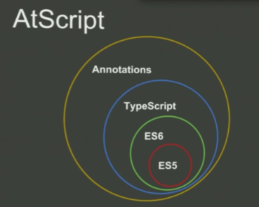

# Pourquoi TypeScript ?

## Présentation de TypeScript

TypeScript est un langage gratuit et open-source développé et maintenu par Microsoft depuis octobre 2012.

TypeScript est une surcouche d'ECMAScript permettant l'ajout optionnel de typage statique.

Il n'existe actuellement pas de réel runtime TypeScript. Il faut utiliser un compilateur pour transpiler le code TypeScript en code ECMAScript valide que l'on peut ensuite exécuter sur le runtime JavaScript de notre choix : Browser, NodeJS etc...

TypeScript est un parfait compromis entre la flexibilité d'un langage dynamiquement typé et la rigueur d'un langage statiquement typé sans tomber dans la lourdeur syntaxique associée et ce grâce à d'intéressants concepts tels que le "duck typing" ou l'inférence de type.

TypeScript n'est pas un standard et aucun support n'est prévu sur les navigateurs, d'autant plus que contrairement à l'ECMAScript, TypeScript est typé statiquement et nécessitera donc toujours une transpilation.

## Feu AtScript

Initialement, Angular devait utiliser le langage AtScript prévu comme surcouche du TypeScript mais en Mars 2015, Microsoft annonce le support des fonctionnalités AtScript dans la prochaine version de TypeScript \(1.5\). AtScript a alors été abandonné avant sa naissance.

L'idée d'AtScript était d'introduire les annotations _\(d'où le nom du langage\)_ qui ont finalement été introduits en TypeScript 1.5 sous le noms de "decorators" comme dans d'autres langages _\(Python par exemple\)_. __

